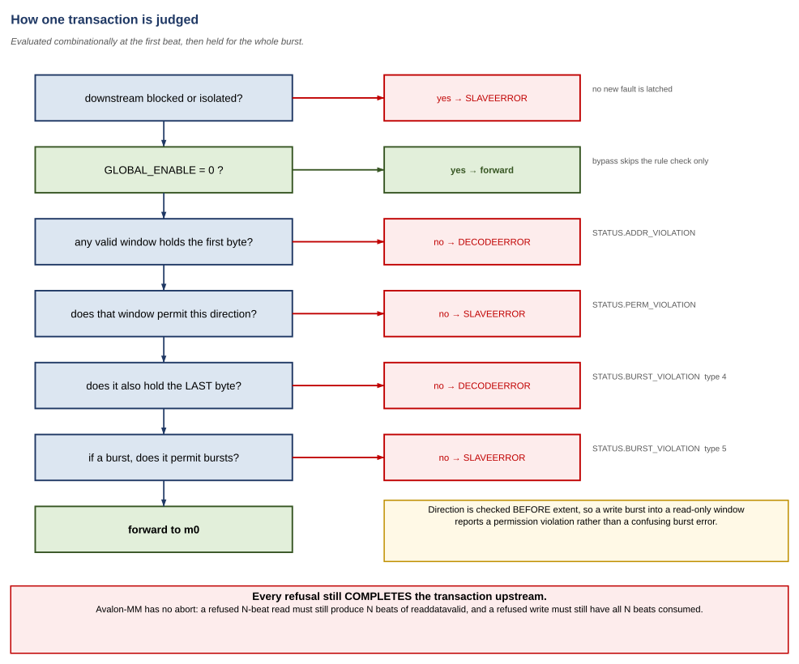
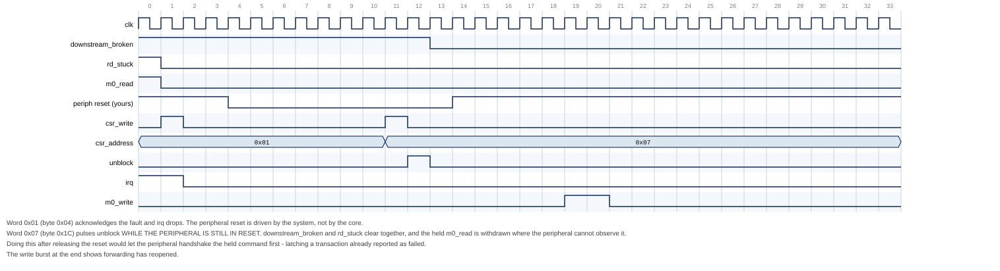

# Avalon-MM Firewall

## Block Diagrams and Descriptions

**Core:** `altera_avalon_mm_firewall`
**Version:** 1.0
**Document version:** 1.0
**Last updated:** August 2026

---

This is the architecture companion to the
[user guide](avalon_mm_firewall_user_guide.md). The user guide tells you how to
use the core; this document shows what is inside it and why it is shaped that
way.

Every figure here is **generated**. The block diagrams are drawn from
`doc/tools/diagrams/build_figures.py`, and the timing diagrams are cut from a
real VCD by `doc/tools/waveforms/mkwaves.py`. Neither can drift away from the
design without something failing loudly — which is the whole reason for
generating them rather than drawing them.

---

## Contents

1. [System context](#1-system-context)
2. [Internal architecture](#2-internal-architecture)
3. [How a transaction is judged](#3-how-a-transaction-is-judged)
4. [Bursts in motion](#4-bursts-in-motion)
5. [Failure and recovery](#5-failure-and-recovery)
6. [Register map and rule table](#6-register-map-and-rule-table)

---

# 1. System context

**Figure 1. System context**


The core is a bump in the wire. It has three Avalon-MM interfaces and one
interrupt:

| Interface | Role | Notes |
|---|---|---|
| `s0` | Agent, faces the master | Byte-addressed, bursting, pipelined reads |
| `m0` | Host, faces the protected peripheral | Mirrors `s0` |
| `csr` | Agent, configuration and status | 32-bit, word-addressed, fixed read latency 1, never stalls |
| `irq` | Interrupt sender | Level, cleared by clearing the source |

## 1.1 The address map does not move

`s0` declares `bridgesToMaster m0` in the Platform Designer component. That
tells the interconnect that `s0`'s address space *is* `m0`'s: the firewall is
transparent to address assignment, exactly like `altera_avalon_mm_bridge`.

The practical consequence is that inserting this core into an existing system
changes nothing about where anything lives. Existing software keeps working,
existing address assignments stay valid, and the firewall can be added late in
a project without a re-layout of the memory map.

## 1.2 Why the control port is separate

`csr` is deliberately not reachable through `s0`. If configuration went through
the policed path, then:

- a rule that accidentally excluded the firewall's own registers would lock
  software out permanently, and
- a wedged peripheral could block the very port needed to recover from it.

Keeping it separate also lets `csr` be the dullest possible Avalon-MM agent:
word-addressed, fixed latency, no `waitrequest`, no outstanding-transaction
state. There is nothing in it that can get stuck.

## 1.3 What the core does not own

The peripheral's reset is not driven by the firewall. That is a deliberate
trade: owning it would demand a dedicated reset net per protected peripheral,
which shared reset domains and hard IP frequently cannot provide.

The cost is that recovery from a timeout becomes a software sequence which
*must* have a way to reset the peripheral. A system without one cannot complete
recovery, and a single timeout takes the peripheral out of service until the
whole system is reset. This is the single most important thing to get right at
integration time.

---

# 2. Internal architecture

**Figure 2. Internal architecture**


## 2.1 A gate, not a buffer

The central decision is that permitted traffic is **gated, not captured**.
`m0_read` and `m0_write` are `s0_read` and `s0_write` gated by the rule
verdict; `s0_waitrequest` is `m0_waitrequest` unmodified; read data flows back
untouched. There is no data storage anywhere in the data path.

This is what makes the core usable in front of a DMA engine. The alternative —
capture, evaluate, re-drive — is what the AXI4-Lite sibling does, and it costs
six cycles per transaction, which a burst cannot amortise because Platform
Designer's burst adapter has already split it into single beats by then.

The price is paid in timing, not cycles: the rule lookup is combinational and
sits between `s0_address` and both `m0_read`/`m0_write` and `s0_waitrequest`.
It is the critical path, and it grows with `NUM_RULES`.

## 2.2 The blocks

| Block | What it does |
|---|---|
| **Burst extent** | Computes `last = address + burstcount × bytes − 1` with one guard bit, so a burst wrapping the top of the address space is detected rather than aliasing |
| **Rule lookup ×2** | Two independent combinational lookups, one per channel, so read and write get an answer in the same cycle without contending |
| **Pass-through gate** | The gating itself |
| **Deny responder** | Owns `rd_deny_beats`: the debt the core owes a master whose burst it refused |
| **Progress watchdog** | Counts cycles without progress on a forwarded transaction |
| **`downstream_broken`** | The latch that walls the peripheral off. Set by the watchdog, cleared only by `RECOVERY.UNBLOCK` |
| **Register block** | Rule table, sticky status, interrupt, fault latch, recovery |

## 2.3 Why the lookup takes two addresses

Each lookup port is given the **first and last byte** of the transaction, not
just the address. It reports whether a valid window contains the first byte,
and whether that *same* window also contains the last.

Checking only the start address produces a firewall that a bursting master
walks straight through: begin one beat inside a permitted window, run for 128
beats, and you are reading whatever is mapped after it. For a core whose entire
reason for existing is bursting masters, that would be the defect that matters
most.

Two consequences follow from checking against the *same* window rather than the
table as a whole:

- **Adjacent windows do not merge.** A burst crossing the boundary between two
  abutting permitted windows is refused. Permissions are per-window, and such a
  burst would have to satisfy both.
- **`BURST_ALLOW` is per-window.** "This peripheral cannot handle bursts" is a
  property of the peripheral, and a real system has both kinds behind one
  firewall.

## 2.4 Key internal signals

| Signal | Meaning |
|---|---|
| `wr_beats_left` | Beats still expected in the current write burst. Non-zero means a burst is in progress and the verdict is latched |
| `wr_fwd` | The current write burst is being forwarded, as opposed to swallowed |
| `rd_fwd_beats` | Read beats owed by the peripheral. Also the orphan filter: `m0_readdatavalid` is forwarded only while this is non-zero |
| `rd_deny_beats` | Read beats the core itself owes the master |
| `wr_stuck` / `rd_stuck` | A command is frozen because its `waitrequest` never fell |
| `downstream_broken` | Forwarding is refused; only `UNBLOCK` clears it |

---

# 3. How a transaction is judged

**Figure 3. Verdict**



The verdict is formed combinationally at the first beat and held for the whole
burst. On beats 2..N of an Avalon-MM write burst the master presents only
`writedata` — re-evaluating per beat would be evaluating garbage.

## 3.1 Order of checks

Two orderings are load-bearing.

**Blocked before bypass.** `CTRL.GLOBAL_ENABLE = 0` disables *access control*,
not *fault isolation*. A peripheral already walled off after a timeout stays
walled off in bypass mode. Access control and isolation are separate jobs, and
a wedged peripheral is a bus-level hazard regardless of whether anyone is
policing addresses.

**Direction before extent.** A write burst into a read-only window reports
`PERM_VIOLATION`, not a burst error. The window is wrong for this access
entirely; how far the burst would have run is a secondary detail and reporting
it first would send whoever is debugging in the wrong direction.

## 3.2 Verdict, response and status

| Verdict | Response | Sticky bit | `FAULT_INFO.TYPE` |
|---|---|---|---|
| Address in no valid window | `DECODEERROR` | `ADDR_VIOLATION` | 1 |
| Window forbids this direction | `SLAVEERROR` | `PERM_VIOLATION` | 2 |
| Downstream stopped progressing | `SLAVEERROR` | `TIMEOUT_ERROR` | 3 |
| Burst extends past the window | `DECODEERROR` | `BURST_VIOLATION` | 4 |
| Window forbids bursts | `SLAVEERROR` | `BURST_VIOLATION` | 5 |
| Refused because blocked | `SLAVEERROR` | *(none)* | *(none)* |

`DECODEERROR` is used where the transaction reaches addresses that, as far as
this window is concerned, are not there. `SLAVEERROR` is used where the address
is real but the access is not allowed.

The last row is the subtle one. A rejection *while blocked* latches nothing,
because the timeout that caused the block already latched a fault. Latching
again on every subsequent rejected access would overwrite the `FAULT_ADDR`
that actually diagnoses the problem, replacing it with whatever the driver
happened to retry.

---

# 4. Bursts in motion

## 4.1 A permitted burst

**Figure 4. Permitted write burst**


Nothing happens to it. The beats appear on `m0` in the same cycles they appear
on `s0`, and `s0_waitrequest` is `m0_waitrequest`. `wr_beats_left` is the only
state involved — it holds the burst together so that the verdict formed at beat
1 governs beats 2 through N, whose addresses are not meaningful.

## 4.2 A refused burst

**Figure 5. Refused read burst**


This is the case with no AXI analogue, and the reason a large part of the core
exists.

Avalon-MM has no way to refuse a transaction. A refused 4-beat read must still
produce four beats of `readdatavalid`, or the master waits forever. So "deny"
does not mean "ignore" — the firewall becomes the responder:

1. The command is **accepted immediately**, `waitrequest` low. It is never
   stalled on the rule check, because stalling would simply move the hang from
   the peripheral into the firewall.
2. `rd_deny_beats` is loaded with the burst length. That is the debt.
3. One beat per cycle is synthesised until the debt is paid, carrying the error
   response and **zero data, not stale data**.
4. `m0` is never touched. The protected peripheral does not see the
   transaction at all.

`irq` asserts on the way through, because the sticky status bit is set and its
interrupt is enabled.

Only one refused read burst is in flight at a time, and no new read is accepted
while one is draining. That is what satisfies Avalon-MM's in-order read
response requirement without a reorder buffer. Refusals are errors, so the
throughput cost is irrelevant; permitted reads pipeline freely.

---

# 5. Failure and recovery

## 5.1 The hang

**Figure 6. Timeout**


The Avalon-MM hang mode is `waitrequest` stuck high, or `readdatavalid` that
never arrives. The watchdog counts cycles **without progress** — not
transaction duration. Timing whole transactions would force `TIMEOUT_VALUE` to
be scaled by the longest burst in the system, which makes it useless as a hang
detector.

On expiry the core:

1. completes the transaction upstream itself, so the master never hangs;
2. latches `downstream_broken`;
3. **leaves `m0_read` asserted.**

Point 3 is the one to look at in the figure. Avalon-MM requires a host to hold
`read` or `write` asserted until `waitrequest` deasserts. Withdrawing it can
wedge the interconnect between the firewall and the peripheral, not merely the
peripheral. So the core distinguishes two kinds of damage:

| | Avoidable? | What the core does |
|---|---|---|
| A forwarded burst abandoned part-way, leaving the peripheral waiting for beats | No — the master must be released, and Avalon-MM has no burst-abort | Accepts it. This is why the peripheral reset is mandatory |
| A command withdrawn before its handshake completed | Yes | Never does it. `rd_stuck`/`wr_stuck` record that one is being held |

## 5.2 The recovery

**Figure 7. Recovery**



```
1. Stop issuing transactions to s0.
2. Write 1 to the sticky STATUS bits.
3. Poll STATUS until WR_BUSY and RD_BUSY clear - WITH A BOUND.
4. ASSERT the peripheral's reset and HOLD it.
5. Write RECOVERY.UNBLOCK - while the reset is still asserted.
6. Release the peripheral's reset.
7. Resume.
```

**Steps 5 and 6 are in this order deliberately**, and this is where the core
deviates from AMD's published AXI Firewall flow, which resets and then
unblocks. `UNBLOCK` is what withdraws the frozen command. If the peripheral is
already out of reset when that write lands, it can complete the frozen
command's handshake first — latching a transaction the firewall has already
reported to the master as failed. Withdrawing it while the peripheral cannot
see the bus removes that window, and costs nothing.

That ordering was not designed in. It came out of a coverage gap: the cover
point `c_unblock_with_stuck_cmd` sat at zero hits with the reset-then-unblock
sequence, because the freshly-released peripheral always handshaked the frozen
command away before `UNBLOCK` arrived. A branch that refuses to be covered is
sometimes telling you the sequence is wrong rather than that the stimulus is
weak.

**Bound the poll in step 3.** `WR_BUSY` and `RD_BUSY` mean *the peripheral owes
us something*, and a peripheral that accepted a command and then died owes it
forever. An unbounded poll hangs exactly when recovery matters most.

Two further points visible in the figure:

- Acknowledging the fault (step 2) drops `irq` but does **not** clear
  `BLOCKED`. Clearing a fault must not accidentally restart traffic toward a
  peripheral nobody has reset.
- Traffic attempted while blocked is **answered with an error, not stalled**.
  There is no window in which the firewall quietly holds transactions until
  recovery finishes, so drivers need a retry path.

---

# 6. Register map and rule table

**Figure 8. Register map and bit fields**


## 6.1 Addressing

`csr` is word-addressed in hardware — Platform Designer's default for an
Avalon-MM agent. Every offset quoted in the documentation is a **byte** offset,
because that is what software passes to `IOWR_32DIRECT()`; the interconnect
performs the divide-by-four. Nothing in a driver needs to scale anything.

## 6.2 The rule table

Each window is three registers at `0x40 + i × 0x10`:

| Word | Register |
|---|---|
| +0x0 | `RULE_BASE[i]` — first byte, inclusive |
| +0x4 | `RULE_LIMIT[i]` — last byte, inclusive |
| +0x8 | `RULE_PERM[i]` — read / write / valid / burst |
| +0xC | reserved, reads zero |

The lowest-index valid window containing the start address wins. Windows need
not be disjoint.

Because a window is described by three registers, updating a **live** window
leaves a transient in which the base is new and the limit is still old — a
window describing a range nobody intended, live on the bus, for a few cycles.
Clear `VALID` first when reconfiguring an active window; default-deny then
covers the gap. At initialisation this is unnecessary, since `VALID` is 0 out
of reset.

## 6.3 Secure at reset

`CTRL` resets to `GLOBAL_ENABLE | AUTO_ISOLATE_EN` and the entire rule table
resets invalid. The core therefore comes out of reset denying everything, with
fault isolation armed. The interval between reset and the first configuration
write is exactly when default-deny should be in force, which is why the driver
never writes `CTRL` during initialisation.

## 6.4 Identifying the core from software

`CORE_INFO` at byte 0x18 describes the hardware as generated: `NUM_RULES` in
[7:0], `BURST_WIDTH` in [12:8], log2 of the bytes per beat in [15:13], and the
version in [31:16], which reads **0x0100** for v1.0.

A driver should check the version field before touching any other register.
The register map is not self-describing beyond this word, and a driver writing
v1.0 offsets into a future core would fail silently rather than loudly — the
wrong direction to fail for a security peripheral.

## 6.5 The fault latch

`FAULT_ADDR` and `FAULT_INFO` are a single shared latch, updated by each new
fault. `FAULT_ADDR` holds the **start address of the transaction**, not the
address of the offending beat within a burst.

`FAULT_INFO.BURSTCOUNT` saturates at 255 rather than truncating: a 256-beat
burst reading back as 0 would be worse than useless in a field whose whole
purpose is to say how large the offending transfer was.

If a read fault and a write fault land in the same cycle, both sticky bits set
correctly but the shared latch captures the write side. That is a documented,
deterministic tie-break rather than a race.

Read the fault registers **before** acknowledging. Acknowledging reopens the
core to traffic that can fault again immediately and overwrite them.
