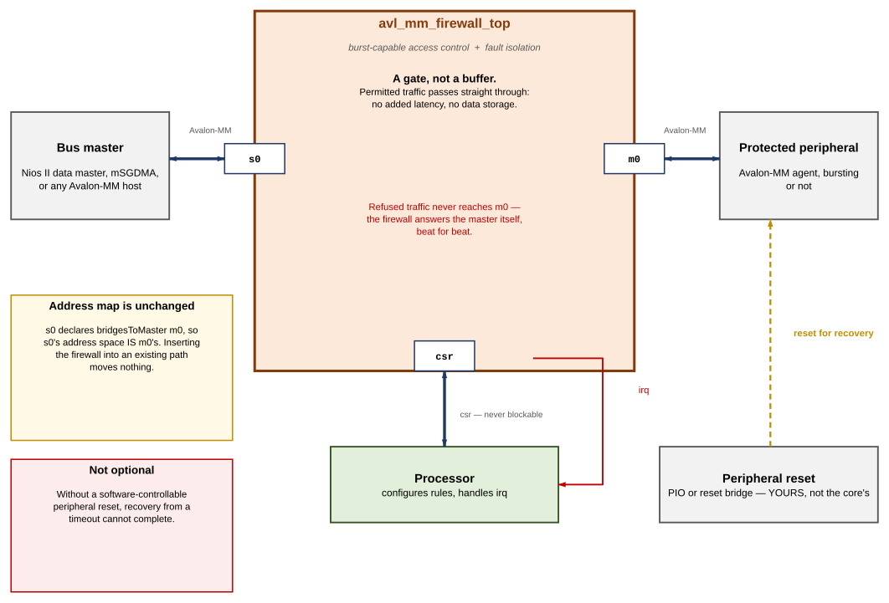
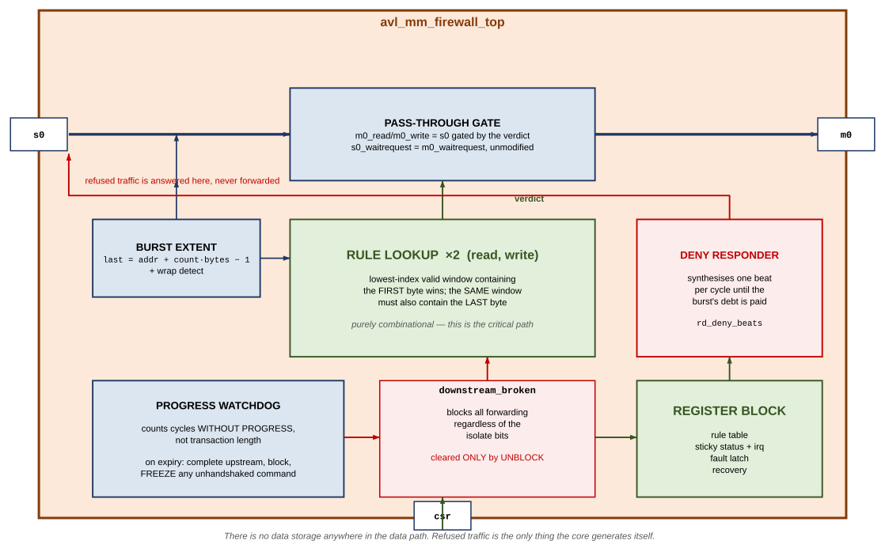
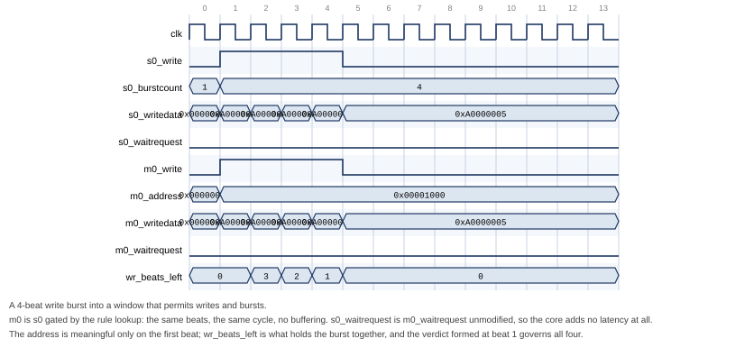
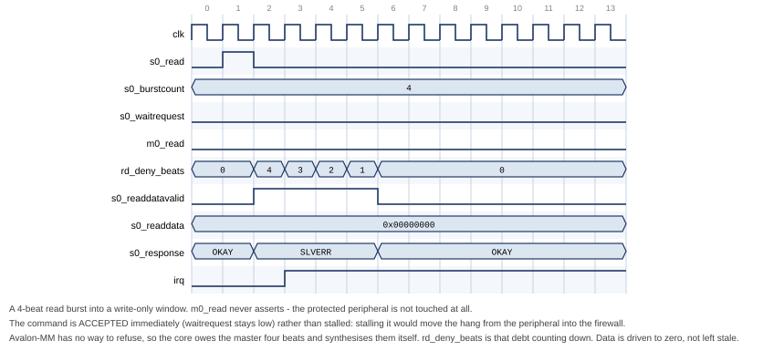
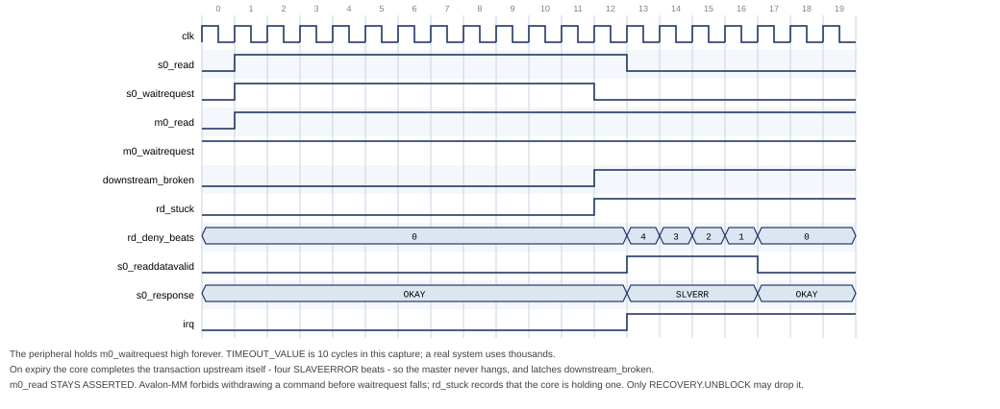
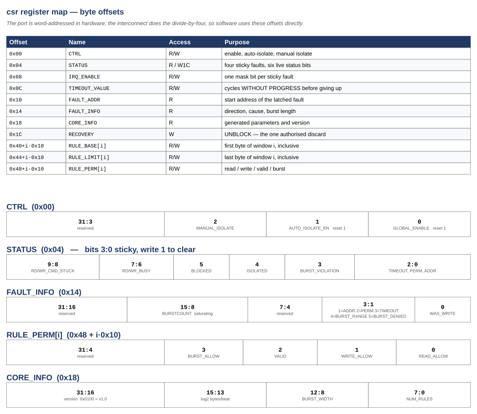

# Avalon-MM Firewall IP Core

## User Guide

**Core:** `altera_avalon_mm_firewall`
**Version:** 1.0
**Document version:** 1.0
**Last updated:** August 2026

---

Subscribe to changes by watching the repository. Send feedback by opening an
issue against `monkstein88/altera-ip-cores`.

---

## Contents

1. [About the Avalon-MM Firewall IP Core](#1-about-the-avalon-mm-firewall-ip-core)
   1.1 [Features](#11-features)
   1.2 [Device Family Support](#12-device-family-support)
   1.3 [Resource Utilization](#13-resource-utilization)
   1.4 [Release Information](#14-release-information)
2. [Getting Started](#2-getting-started)
   2.1 [Installing the IP Core](#21-installing-the-ip-core)
   2.2 [Adding the Core to a Platform Designer System](#22-adding-the-core-to-a-platform-designer-system)
   2.3 [Required Connections](#23-required-connections)
   2.4 [Simulating the IP Core](#24-simulating-the-ip-core)
   2.5 [Files Provided](#25-files-provided)
3. [Functional Description](#3-functional-description)
   3.1 [Block Diagram](#31-block-diagram)
   3.2 [Access Control](#32-access-control)
   3.3 [Burst Handling](#33-burst-handling)
   3.4 [Rule Evaluation](#34-rule-evaluation)
   3.5 [Error Responses](#35-error-responses)
   3.6 [Fault Isolation and Timeout](#36-fault-isolation-and-timeout)
   3.7 [Recovery Sequence](#37-recovery-sequence)
   3.8 [Interrupts](#38-interrupts)
   3.9 [Control Port Behaviour](#39-control-port-behaviour)
   3.10 [Reset](#310-reset)
   3.11 [Latency and Throughput](#311-latency-and-throughput)
4. [Parameters](#4-parameters)
5. [Interface Signals](#5-interface-signals)
6. [Register Map](#6-register-map)
7. [Software Programming Model](#7-software-programming-model)
8. [Verification](#8-verification)
9. [Design Considerations and Limitations](#9-design-considerations-and-limitations)
10. [Document Revision History](#10-document-revision-history)

---

# 1. About the Avalon-MM Firewall IP Core

The Avalon-MM Firewall IP core is a bump-in-the-wire component that sits
between a bus master and a peripheral you want to protect. It enforces an
allow-list on every transaction, and guarantees the master always receives a
complete response even when the protected peripheral stops answering.

There is no equivalent core in the Intel FPGA IP catalog. AMD/Xilinx ship an
AXI Protocol Firewall, but that core polices protocol legality and has no
address-range access control; the two are complementary rather than
equivalent.

The core is fully burst-capable. It is a pass-through gate rather than a
store-and-forward buffer: a permitted transaction reaches the protected
peripheral with **no added latency and no data storage anywhere in the core**,
so a DMA engine behind the firewall runs at the same rate it would without it.
A refused transaction never reaches the peripheral at all, and is answered by
the firewall itself.

> **Note:** A companion core, `altera_axi4_lite_firewall`, provides the same
> function for AXI4-Lite. That core is single-transaction and non-bursting: a
> bursting master in front of it is split into single beats by Platform
> Designer's burst adapter, and each beat pays a six-cycle cost. Use this core
> for any master that bursts.

## 1.1 Features

- **Allow-list access control.** Up to 64 software-programmable address
  windows, each with independent read, write and burst permission. Any address
  not described by a valid window is denied. The core is secure at reset:
  access control is enabled and the rule table is empty, so everything is
  denied until software says otherwise.
- **Burst-aware range checking.** The first *and last* byte of every
  transaction are checked against the same matched window, so a burst cannot
  begin inside a permitted window and run past its end.
- **Per-window burst capability.** A window can permit single accesses while
  refusing bursts, for peripherals that cannot handle them.
- **Fault isolation with a hard guarantee that the master never hangs.** If
  the protected peripheral stops making progress, the core completes the
  outstanding transaction itself — synthesising the read beats it owes, or
  consuming the write beats it must — and walls the peripheral off.
- **Protocol-safe abandonment.** The core never withdraws a command whose
  `waitrequest` handshake has not completed. Such a command is frozen and held
  until software explicitly authorises discarding it.
- **Zero added latency** on permitted transactions, with full burst
  throughput of one beat per cycle.
- **Pipelined reads**, with a configurable outstanding-beat budget.
- **Separate control port**, so configuration and status are never subject to
  the firewall's own rules and remain reachable when the data path is isolated.
- **Level interrupt** on any enabled fault, with per-source masking, and a
  latched record of the offending address, direction, cause and burst length.
- **Nios II HAL driver** provided, including the full recovery sequence.

## 1.2 Device Family Support

The core is plain synthesisable SystemVerilog with no device primitives, no
vendor-specific attributes and no inferred memory. It is expected to compile
for any Intel/Altera family supported by your Quartus Prime installation.

> **Caution:** Device support has not been characterised on hardware. See
> [Section 9](#9-design-considerations-and-limitations).

## 1.3 Resource Utilization

Not characterised. The design is a rule table plus comparators and a handful
of counters; the dominant term is `NUM_RULES`, which instantiates two
`ADDR_WIDTH`-wide magnitude comparators per rule per channel.

> **Caution:** No synthesis results are quoted anywhere in this document. A
> number here would be a guess, and a guess in a resource table is
> indistinguishable from a measurement.

## 1.4 Release Information

| Item | Value |
|---|---|
| Version | 1.0 |
| `CORE_INFO` version field | 0x0100 |
| Release date | August 2026 |
| Ordering code | None — source-provided |

---

# 2. Getting Started

## 2.1 Installing the IP Core

1. Clone or copy the `altera-ip-cores` repository to your machine.
2. In Quartus Prime, choose **Tools ▸ Options ▸ IP Catalog Search Locations**
   and add the repository's **top-level** directory (the one containing
   `altera_avalon_mm_firewall/`, not that directory itself).
3. In Platform Designer, choose **File ▸ Refresh System**.

The core appears in the IP Catalog as **Avalon-MM Firewall**, under *Bridges
and Adapters / Custom*.

> **Note:** Hand-written `_hw.tcl` syntax has drifted across Quartus releases.
> If the component does not import cleanly, package it with the Component
> Editor instead: add the three files under `rtl/` as synthesis files with
> `avl_mm_firewall_pkg.sv` **first** in the list and `avl_mm_firewall_top.sv`
> as the top-level file, then click **Analyze Synthesis Files**. Signal
> analysis groups the `s0_*`, `m0_*` and `csr_*` ports automatically. The one
> property it cannot infer is `bridgesToMaster` on `s0` — set it by hand in
> *Signals & Interfaces*, then **Finish** to export an `_hw.tcl` correct for
> your exact toolchain.

## 2.2 Adding the Core to a Platform Designer System

The core is inserted into an existing connection, between a master and the
peripheral being protected:

1. Instantiate **Avalon-MM Firewall**.
2. Disconnect the master from the peripheral.
3. Connect the master to `s0`, and `m0` to the peripheral.
4. Connect the CPU's data master to `csr`, and assign it a base address.
5. Connect `clock` and `reset` to the system clock and reset network.
6. Connect `irq` to a CPU interrupt input.

> **Note:** Because `s0` declares `bridgesToMaster m0`, `s0`'s address space
> *is* `m0`'s. **The protected peripheral's address does not change when you
> insert the firewall.** Existing software and existing address assignments
> continue to work.

## 2.3 Required Connections

| Interface | Connect to | Required |
|---|---|---|
| `clock` | System clock | Yes |
| `reset` | System reset | Yes |
| `s0` | The master whose accesses are to be policed | Yes |
| `m0` | The peripheral being protected | Yes |
| `csr` | A processor data master | Yes — without it the rule table stays empty and everything is denied |
| `irq` | A processor interrupt input | Recommended. Without it, violations are visible only by polling `STATUS` |

**Additionally, and not a Platform Designer connection:** the protected
peripheral's reset must be controllable by software. The core does not drive
it, but recovery from a timeout requires asserting it. A Platform Designer
reset bridge under software control, or a PIO bit, is sufficient. See
[Section 3.7](#37-recovery-sequence).

> **Caution:** A system with no software-controllable peripheral reset cannot
> complete the recovery sequence. A single timeout then takes the protected
> peripheral out of service until the whole system is reset.

## 2.4 Simulating the IP Core

A self-checking testbench, SystemVerilog assertions and two simulation flows
are provided. None requires a Quartus licence.

```bash
# Verilator: strict elaboration, lint, parameter sweep, then the regression
# run twice - once per USE_WRITE_RESPONSE setting.
pip install pyslang
simulation/verilator/run_sim.sh
```

```tcl
# Questa: adds code, assertion and cover-directive coverage.
cd simulation/questa
do run_sim.tcl
```

```bash
# Icarus: functional tests only; -DICARUS omits the assertion bind.
iverilog -g2012 -DICARUS -o tb.out rtl/avl_mm_firewall_pkg.sv \
    rtl/avl_mm_firewall_regs.sv rtl/avl_mm_firewall_top.sv tb/avl_mm_firewall_tb.sv
vvp tb.out
```

## 2.5 Files Provided

| File | Purpose |
|---|---|
| `avl_mm_firewall_hw.tcl` | Platform Designer component description |
| `rtl/avl_mm_firewall_pkg.sv` | Response codes, verdict enumeration, rule layout. **Compile first** |
| `rtl/avl_mm_firewall_top.sv` | Data path, burst handling, timeout and isolation |
| `rtl/avl_mm_firewall_regs.sv` | Rule table, status, interrupt, control port |
| `tb/avl_mm_firewall_tb.sv` | Self-checking testbench and peripheral model |
| `tb/avl_mm_firewall_sva.sv` | Assertions and cover points |
| `avl_mm_firewall_sw.tcl` | Nios II BSP driver description. **Required** for the BSP to find the driver |
| `inc/altera_avalon_mm_firewall_regs.h` | Register offsets, accessors and bit masks. Depends only on `<io.h>` |
| `HAL/inc/altera_avalon_mm_firewall.h` | Driver API and BSP auto-initialisation macros |
| `HAL/src/altera_avalon_mm_firewall.c` | Nios II HAL driver |
| `simulation/verilator/run_sim.sh` | Licence-free regression |
| `simulation/questa/run_sim.tcl` | Regression with coverage |

---

# 3. Functional Description

## 3.1 Block Diagram

**Figure 1. System context**



The core presents three Avalon-MM interfaces and one interrupt:

- **`s0`** — Avalon-MM agent (slave). Faces the master. Byte-addressed,
  bursting, pipelined reads.
- **`m0`** — Avalon-MM host (master). Faces the protected peripheral. Same
  width and burst capability as `s0`.
- **`csr`** — Avalon-MM agent. 32-bit, word-addressed, fixed read latency of
  1, never asserts `waitrequest`.
- **`irq`** — level interrupt.

**Figure 2. Internal architecture**



Internally the core is a *gate*, not a buffer. There is no data storage
anywhere in the data path. A permitted transaction's `read`/`write` is
forwarded to `m0` gated by the rule lookup, `s0_waitrequest` is `m0_waitrequest`
unmodified, and read data flows back untouched. A refused transaction never
reaches `m0`, and the core answers the master itself.

## 3.2 Access Control

Every transaction presented on `s0` is checked against a table of `NUM_RULES`
address windows. Each window has:

| Field | Meaning |
|---|---|
| `RULE_BASE[i]` | First byte of the window, inclusive |
| `RULE_LIMIT[i]` | Last byte of the window, inclusive |
| `RULE_PERM[i].VALID` | The window is ignored entirely when clear |
| `RULE_PERM[i].READ_ALLOW` | Reads are permitted |
| `RULE_PERM[i].WRITE_ALLOW` | Writes are permitted |
| `RULE_PERM[i].BURST_ALLOW` | `burstcount > 1` is permitted |

The model is **default-deny**. An address that falls in no valid window is
refused. Out of reset the whole table is invalid, so the core denies
everything until software programs it.

Setting `CTRL.GLOBAL_ENABLE` to 0 puts the core in **bypass mode**, where the
rule check is skipped and every transaction is forwarded.

> **Caution:** Bypass mode disables *access control*, not *fault isolation*. A
> peripheral the core has already walled off after a timeout stays walled off
> in bypass mode. This is deliberate: the two are separate jobs, and a wedged
> peripheral is a bus-level hazard regardless of whether you are policing
> addresses.

## 3.3 Burst Handling

Bursts are where a firewall is easiest to get subtly wrong, and four
properties of Avalon-MM shape the design.

**A refused transaction must still be completed.** Avalon-MM has no abort. A
refused read burst of N beats must still produce N beats of `readdatavalid`,
or the master waits forever; a refused write burst must still have all N beats
consumed. The core therefore becomes the responder for refused traffic: it
accepts the command immediately — never stalling it — and synthesises the
whole burst's worth of error responses itself. Read beats returned this way
carry zero data, not stale data.

**The whole burst range is checked.** The core computes the last byte the
transaction will touch:

```
last_byte = address + burstcount x (DATA_WIDTH/8) - 1
```

and requires that the window matched by `address` also contains `last_byte`.
A burst that begins inside a permitted window and runs past its end is
refused. A burst that would wrap past the top of the address space is likewise
refused rather than being allowed to alias to low addresses.

**Adjacent windows do not merge.** A burst crossing the boundary between two
abutting permitted windows is refused, even when both windows permit the
access. Permissions are per-window, and such a burst would have to satisfy
both.

**The verdict is latched for the whole burst.** On beats 2..N of an Avalon-MM
write burst the master presents only `writedata`; the address is not
meaningful. The verdict formed at the first beat governs the entire burst.

**Figure 3. Permitted burst — pass-through**



**Figure 4. Refused burst — the firewall answers**



## 3.4 Rule Evaluation

The rule lookup is purely combinational and duplicated, once for the write
channel and once for the read channel, so both get an independent answer in
the same cycle.

**Priority between rules:** the lowest-index valid window containing the
**start address** wins. Windows need not be disjoint; place more specific
windows at lower indices if you use overlapping ranges.

**Priority between checks** within the matched window is *direction before
extent*:

1. Does any valid window contain the start address? If not — `ADDR_VIOLATION`.
2. Does that window permit this direction? If not — `PERM_VIOLATION`.
3. Does that window also contain the last byte? If not — `BURST_VIOLATION`
   (type `BURST_RANGE`).
4. If this is a burst, does that window permit bursts? If not —
   `BURST_VIOLATION` (type `BURST_DENIED`).

Direction is checked first so that a write burst into a read-only window
reports a permission violation rather than a confusing burst error.

> **Note:** All `NUM_RULES` comparators are in the combinational path from
> `s0_address` to `m0_read`/`m0_write` and `s0_waitrequest`. This is the
> critical path of the core. Use the smallest `NUM_RULES` that covers your
> address map.

## 3.5 Error Responses

| Cause | `response` | `STATUS` bit | `FAULT_INFO.TYPE` |
|---|---|---|---|
| Address in no valid window | `DECODEERROR` (2'b11) | `ADDR_VIOLATION` | 1 |
| Window does not permit this direction | `SLAVEERROR` (2'b10) | `PERM_VIOLATION` | 2 |
| Downstream stopped making progress | `SLAVEERROR` | `TIMEOUT_ERROR` | 3 |
| Burst extends past the matched window | `DECODEERROR` | `BURST_VIOLATION` | 4 |
| Window does not permit bursts | `SLAVEERROR` | `BURST_VIOLATION` | 5 |
| Rejected because the core is isolated or blocked | `SLAVEERROR` | *(none)* | *(none)* |

A rejection *while blocked* deliberately raises no new fault. The timeout that
caused the block already latched one; re-latching on every subsequent rejected
access would overwrite the `FAULT_ADDR` that diagnoses the original problem.

> **Caution:** With `USE_RESPONSE` set to 0 the `response` signal is not
> present on the interfaces. Refused reads still return the correct number of
> beats, but they read as zeros with no error indication, and refused writes
> complete silently. The violation is then visible only through `irq` and
> `STATUS`. Leave `USE_RESPONSE` enabled unless your master genuinely cannot
> accept the signal.

## 3.6 Fault Isolation and Timeout

`TIMEOUT_VALUE` sets the number of clock cycles the core will tolerate
**without progress** on a forwarded transaction. Progress means a beat
accepted, a beat of read data returned, or a write response received.

> **Note:** The timeout measures cycles without progress, not total
> transaction duration. This matters for a bursting core: timing whole
> transactions would force `TIMEOUT_VALUE` to be scaled by the longest burst in
> the system, which makes it useless as a hang detector. A 128-beat burst
> against a slow peripheral is progress; a peripheral that has not moved a beat
> in N cycles is not.

When the budget is exhausted the core:

1. **Completes the upstream transaction immediately.** Read beats still owed
   become synthesised `SLAVEERROR` beats; remaining write beats are consumed
   and discarded. The master is released and never hangs.
2. **Latches an internal blocked state**, which refuses all further forwarding
   regardless of the isolate control bits. This is required for protocol
   safety and does not depend on `CTRL.AUTO_ISOLATE_EN`, which governs only the
   visible `ISOLATED` status bit.
3. **Freezes any `m0` command whose `waitrequest` never fell**, holding it
   asserted rather than withdrawing it.
4. **Abandons work on both channels.** A timeout on either channel gives up on
   the peripheral entirely. Letting one channel keep forwarding into a
   peripheral the other has just abandoned would also allow a frozen `m0_read`
   to coexist with a live `m0_write`, which Avalon-MM forbids.

Point 3 deserves emphasis. Avalon-MM requires a host to hold `read` or `write`
asserted until `waitrequest` deasserts. Withdrawing it can wedge the
interconnect between the firewall and the peripheral, not merely the
peripheral. So the core distinguishes two kinds of damage:

| | Avoidable? | What the core does |
|---|---|---|
| A forwarded burst abandoned part-way, leaving the peripheral waiting for beats | **No** — the master upstream must be released, and Avalon-MM has no burst-abort | Accepts it; this is why the peripheral reset in recovery is mandatory |
| A command withdrawn before its handshake completed | **Yes** | Never does it. The command is frozen and held until `RECOVERY.UNBLOCK` |

`STATUS` exposes what is outstanding so software can sequence recovery:

| Bit | Meaning |
|---|---|
| `WR_BUSY` / `RD_BUSY` | The peripheral owes the core a write completion / read beats |
| `WR_CMD_STUCK` / `RD_CMD_STUCK` | The core is holding a command the peripheral never accepted |
| `BLOCKED` | Forwarding is refused; only `RECOVERY.UNBLOCK` clears it |

**Figure 5. Timeout and recovery**



## 3.7 Recovery Sequence

Recovery is an explicit software sequence. The core does not attempt it
automatically, because step 4 requires resetting a peripheral the core does not
own.

```
1. Stop issuing transactions to s0.
2. Write 1 to the sticky STATUS bits.        (acknowledge; also releases
                                              the auto-isolate latch)
3. Poll STATUS until WR_BUSY and RD_BUSY clear - WITH A BOUND.
4. ASSERT the protected peripheral's reset and HOLD it (>= 16 clocks).
5. Write RECOVERY.UNBLOCK - while the reset is still asserted.
6. Release the protected peripheral's reset.
7. Resume.
```

> **Caution:** Steps 5 and 6 are in this order deliberately. `UNBLOCK` is what
> withdraws a frozen `m0` command. If the peripheral is already out of reset
> when that write lands, it can complete the frozen command's handshake first —
> latching a transaction the firewall has already reported to the master as
> failed. Withdrawing the command while the peripheral cannot see the bus
> removes that possibility, and costs nothing.

> **Caution:** Bound the poll in step 3. `WR_BUSY` and `RD_BUSY` mean *the
> peripheral owes us something*, and a peripheral that accepted a command and
> then died owes it forever. An unbounded poll hangs exactly when recovery
> matters most. Treat the bits as advisory: clear means no late response can
> still be in flight and the reset is unambiguously safe; still set means reset
> anyway and let `UNBLOCK` discard what is owed.

> **Caution:** Step 4 is not optional. A truncated burst leaves the peripheral
> mid-transfer, expecting beats that will never arrive. Only a reset clears
> that state.

**Transactions attempted while the core is blocked are answered with an error,
not stalled.** There is no window in which the firewall quietly holds traffic
until recovery completes, so every transaction issued between the fault and the
recovery has failed. **Drivers for peripherals behind this core need a retry
path.**

Note that clearing `STATUS.TIMEOUT_ERROR` releases the auto-isolate latch but
does **not** reopen the downstream. Acknowledging a fault must not accidentally
restart traffic toward a peripheral nobody has reset.

## 3.8 Interrupts

`irq` is a level interrupt, asserted while any sticky `STATUS` bit in [3:0] is
set *and* its corresponding `IRQ_ENABLE` bit is set. It is cleared by clearing
the source: write 1 to the relevant `STATUS` bit. This is the standard
Avalon-MM peripheral idiom and works directly with the Nios II HAL ISR pattern.

Unmasking an already-latched fault asserts `irq` immediately; the enable is a
mask on the output, not on the latching.

`FAULT_ADDR` and `FAULT_INFO` form a single shared latch, updated by each new
fault.

> **Note:** Read `FAULT_ADDR` and `FAULT_INFO` *before* acknowledging.
> Acknowledging reopens the core to traffic that can fault again immediately
> and overwrite them.

If a read fault and a write fault occur in the same cycle, both sticky bits are
set correctly, but `FAULT_ADDR` and `FAULT_INFO` capture the write side. This
is a documented, deterministic tie-break.

## 3.9 Control Port Behaviour

`csr` is deliberately the simplest possible Avalon-MM agent: 32-bit,
word-addressed, fixed read latency of 1, and it never asserts `waitrequest`.
It has no outstanding-transaction state that could get stuck, which is what
makes it trivially safe to reach while the data path is isolated or wedged.

> **Note:** `csr` is **word-addressed** — Platform Designer's default
> `addressUnits` for an Avalon-MM agent. All offsets in
> [Section 6](#6-register-map) are byte offsets, which is what software uses;
> the interconnect performs the divide-by-four. You do not need to scale
> anything in your driver.

Byte enables are honoured on `csr` writes, including partial writes to
`RULE_BASE`, `RULE_LIMIT` and `TIMEOUT_VALUE`.

The control port is not affected by the firewall's own rules, by
`MANUAL_ISOLATE`, or by a blocked downstream.

## 3.10 Reset

`reset_n` is active-low and synchronous to `clk`. All state is cleared,
including the entire rule table, so the core comes out of reset in
default-deny with access control enabled and auto-isolate enabled.

Reset asserted mid-burst is safe on both channels: the beat counters clear and
the port is immediately usable again.

> **Caution:** Resetting the *firewall* does not reset the *peripheral*. If a
> burst was in flight, the peripheral is left mid-transfer and must be reset
> too — the same requirement as step 4 of the recovery sequence.

## 3.11 Latency and Throughput

Measured by the benchmark in the regression suite, against a zero-wait-state
peripheral model:

| Operation | Cycles | In-suite guard |
|---|---|---|
| 32-beat write burst | 33 | fails above 36 |
| 32-beat read burst, command to last beat | 36 | fails above 40 |

That is one beat per cycle plus the peripheral's own read latency. **The core
adds no cycles of its own.** The guards are part of the regression, so these
numbers cannot silently regress.

Refused transactions are answered at one beat per cycle after a one-cycle
acceptance, and never touch the peripheral.

---

# 4. Parameters

| Parameter | Default | Range | HDL | Description |
|---|---|---|---|---|
| `ADDR_WIDTH` | 32 | 8–32 | Yes | Byte address width of `s0` and `m0`. `RULE_BASE`/`RULE_LIMIT` are this wide |
| `DATA_WIDTH` | 32 | 8–1024, power of two | Yes | Data width of `s0` and `m0` |
| `BURST_WIDTH` | 8 | 1–11 | Yes | Width of `burstcount`. Maximum burst is 2^(`BURST_WIDTH`−1) beats. 1 means non-bursting |
| `MAX_PENDING_READS` | 4 | 1–32 | Yes | Read bursts trackable at once. Sets the outstanding-beat budget and is published to Platform Designer on both ports |
| `NUM_RULES` | 8 | 1–64 | Yes | Number of address windows |
| `TIMEOUT_WIDTH` | 20 | 8–32 | Yes | Maximum programmable timeout is 2^`TIMEOUT_WIDTH`−1 cycles |
| `CSR_ADDR_WIDTH` | 8 | 5–16 | Yes | Control port address width, **in words** |
| `USE_RESPONSE` | 1 | 0, 1 | No | Expose the 2-bit `response` signal on `s0` and `m0` |
| `USE_WRITE_RESPONSE` | 0 | 0, 1 | Yes | Expose `writeresponsevalid`. Requires `USE_RESPONSE` |

## Choosing values

**`BURST_WIDTH`** should match the master in front of the firewall. A Nios II/f
data master with a data cache bursts up to its line length; an mSGDMA commonly
uses up to 128 beats, which is `BURST_WIDTH = 8`. Making it larger than
necessary only widens the range comparators.

**`NUM_RULES`** is the main cost and timing driver. Use the smallest number
that covers your address map.

**`CSR_ADDR_WIDTH`** is in words, and must cover word `0x10 + NUM_RULES × 4`
— that is, byte `0x40 + NUM_RULES × 16`.

**`TIMEOUT_VALUE`** (the register, not a parameter) should be a few times the
worst legitimate stall of the protected peripheral. Because the counter
measures cycles without progress, it does not need scaling by burst length.

## Validation

Three configurations elaborate, simulate and are quietly wrong. `hw.tcl`
rejects all three at generation time:

| Check | Why it matters |
|---|---|
| `CSR_ADDR_WIDTH` covers the whole rule table | Otherwise high-index rules are silently unreachable and appear to be permanently invalid |
| `ADDR_WIDTH` ≥ `BURST_WIDTH`−1 + log2(`DATA_WIDTH`/8) | Otherwise a single maximum-length burst can span the entire address space and the range check stops meaning anything |
| `USE_WRITE_RESPONSE` implies `USE_RESPONSE` | `writeresponsevalid` qualifies `response`; without `response` there is nothing to qualify |

The component also emits informational messages when `USE_RESPONSE` is
disabled, and when `BURST_WIDTH` is 1 and the burst machinery therefore has no
effect.

---

# 5. Interface Signals

## 5.1 Clock and Reset

| Signal | Direction | Width | Description |
|---|---|---|---|
| `clk` | Input | 1 | Clock for all three interfaces |
| `reset_n` | Input | 1 | Active-low synchronous reset |

## 5.2 `s0` — Avalon-MM Agent (data path)

Byte-addressed (`addressUnits SYMBOLS`), bursting, variable read latency.

| Signal | Direction | Width | Description |
|---|---|---|---|
| `s0_address` | Input | `ADDR_WIDTH` | Byte address. Valid with the first beat of a burst |
| `s0_read` | Input | 1 | Read command |
| `s0_write` | Input | 1 | Write command |
| `s0_writedata` | Input | `DATA_WIDTH` | Write data |
| `s0_byteenable` | Input | `DATA_WIDTH`/8 | Byte enables, forwarded unmodified |
| `s0_burstcount` | Input | `BURST_WIDTH` | Beats in this burst, in words |
| `s0_waitrequest` | Output | 1 | Stall. May be combinationally dependent on `read`/`write` |
| `s0_readdata` | Output | `DATA_WIDTH` | Read data. Zero on refused reads |
| `s0_readdatavalid` | Output | 1 | Qualifies `s0_readdata` |
| `s0_response` | Output | 2 | Present when `USE_RESPONSE` = 1 |
| `s0_writeresponsevalid` | Output | 1 | Present when `USE_WRITE_RESPONSE` = 1 |

## 5.3 `m0` — Avalon-MM Host (data path)

Byte-addressed, bursting, variable read latency. Mirrors `s0`.

| Signal | Direction | Width | Description |
|---|---|---|---|
| `m0_address` | Output | `ADDR_WIDTH` | |
| `m0_read` | Output | 1 | |
| `m0_write` | Output | 1 | |
| `m0_writedata` | Output | `DATA_WIDTH` | |
| `m0_byteenable` | Output | `DATA_WIDTH`/8 | |
| `m0_burstcount` | Output | `BURST_WIDTH` | |
| `m0_waitrequest` | Input | 1 | |
| `m0_readdata` | Input | `DATA_WIDTH` | |
| `m0_readdatavalid` | Input | 1 | Ignored unless beats are owed |
| `m0_response` | Input | 2 | Present when `USE_RESPONSE` = 1 |
| `m0_writeresponsevalid` | Input | 1 | Present when `USE_WRITE_RESPONSE` = 1 |

## 5.4 `csr` — Avalon-MM Agent (control and status)

**Word-addressed**, 32-bit, fixed read latency 1, no `waitrequest`.

| Signal | Direction | Width | Description |
|---|---|---|---|
| `csr_address` | Input | `CSR_ADDR_WIDTH` | Word address |
| `csr_read` | Input | 1 | |
| `csr_write` | Input | 1 | |
| `csr_writedata` | Input | 32 | |
| `csr_byteenable` | Input | 4 | Honoured on all writable registers |
| `csr_readdata` | Output | 32 | Valid one cycle after `csr_read` |

## 5.5 Interrupt

| Signal | Direction | Width | Description |
|---|---|---|---|
| `irq` | Output | 1 | Level interrupt, associated with `csr` |

---

# 6. Register Map

All offsets are **byte** offsets from the `csr` base address, which is what
software uses. The hardware port is word-addressed; the interconnect handles
the conversion.

| Offset | Name | Access | Reset |
|---|---|---|---|
| 0x00 | `CTRL` | R/W | 0x0000_0003 |
| 0x04 | `STATUS` | R / W1C on [3:0] | 0x0000_0000 |
| 0x08 | `IRQ_ENABLE` | R/W | 0x0000_000F |
| 0x0C | `TIMEOUT_VALUE` | R/W | all-ones |
| 0x10 | `FAULT_ADDR` | R | 0x0000_0000 |
| 0x14 | `FAULT_INFO` | R | 0x0000_0000 |
| 0x18 | `CORE_INFO` | R | build-dependent |
| 0x1C | `RECOVERY` | W | — |
| 0x40 + i·0x10 | `RULE_BASE[i]` | R/W | 0x0000_0000 |
| 0x44 + i·0x10 | `RULE_LIMIT[i]` | R/W | 0x0000_0000 |
| 0x48 + i·0x10 | `RULE_PERM[i]` | R/W | 0x0000_0000 |

`i` runs from 0 to `NUM_RULES`−1. With the default of 8 rules the table spans
0x40 to 0xBF.

**Figure 6. Register map**



## 6.1 CTRL (0x00)

| Bit | Name | Access | Reset | Description |
|---|---|---|---|---|
| 0 | `GLOBAL_ENABLE` | R/W | 1 | 1 = enforce the rule table. 0 = bypass the rule check. Does **not** disable fault isolation |
| 1 | `AUTO_ISOLATE_EN` | R/W | 1 | 1 = a timeout also sets `STATUS.ISOLATED` |
| 2 | `MANUAL_ISOLATE` | R/W | 0 | 1 = refuse all data-path traffic |
| 31:3 | — | R | 0 | Reserved |

Both enables reset **set**: the core is secure by default.

## 6.2 STATUS (0x04)

Bits [3:0] are sticky and write-1-to-clear. Bits [9:4] are live and read-only.

| Bit | Name | Access | Description |
|---|---|---|---|
| 0 | `ADDR_VIOLATION` | W1C | An access hit no valid window |
| 1 | `PERM_VIOLATION` | W1C | A window matched but did not permit the direction |
| 2 | `TIMEOUT_ERROR` | W1C | The peripheral stopped making progress. Clearing also releases auto-isolate, but does **not** unblock |
| 3 | `BURST_VIOLATION` | W1C | A burst overran its window, or the window forbids bursts. `FAULT_INFO.TYPE` distinguishes the two |
| 4 | `ISOLATED` | R | `MANUAL_ISOLATE` or the auto-isolate latch is set |
| 5 | `BLOCKED` | R | Forwarding is refused. Only `RECOVERY.UNBLOCK` clears this |
| 6 | `WR_BUSY` | R | A forwarded write is outstanding downstream |
| 7 | `RD_BUSY` | R | Read beats are owed by the peripheral |
| 8 | `WR_CMD_STUCK` | R | A frozen write command is being held |
| 9 | `RD_CMD_STUCK` | R | A frozen read command is being held |
| 31:10 | — | R | Reserved |

## 6.3 IRQ_ENABLE (0x08)

| Bit | Name | Reset | Description |
|---|---|---|---|
| 0 | `ADDR_IRQ_EN` | 1 | |
| 1 | `PERM_IRQ_EN` | 1 | |
| 2 | `TIMEOUT_IRQ_EN` | 1 | |
| 3 | `BURST_IRQ_EN` | 1 | |
| 31:4 | — | 0 | Reserved |

Positions correspond one-to-one with `STATUS[3:0]`.

## 6.4 TIMEOUT_VALUE (0x0C)

`TIMEOUT_WIDTH` bits. The number of clock cycles without progress before a
forwarded transaction is abandoned. Resets to all-ones, which for the default
`TIMEOUT_WIDTH` of 20 is over a million cycles and effectively disables the
timeout until software sets it.

## 6.5 FAULT_ADDR (0x10)

Read-only. The **start address** of the transaction that caused the most
recently latched fault — not the address of the offending beat within a burst.

## 6.6 FAULT_INFO (0x14)

| Bit | Name | Description |
|---|---|---|
| 0 | `WAS_WRITE` | 1 = the fault came from a write, 0 = from a read |
| 3:1 | `TYPE` | 1 = ADDR, 2 = PERM, 3 = TIMEOUT, 4 = BURST_RANGE, 5 = BURST_DENIED |
| 7:4 | — | Reserved |
| 15:8 | `BURSTCOUNT` | Burst length of the faulting transaction, saturating at 255 |
| 31:16 | — | Reserved |

`BURSTCOUNT` saturates rather than truncating: a 256-beat burst reading back
as 0 would be worse than useless in a field whose entire purpose is to say how
large the offending transfer was.

## 6.7 CORE_INFO (0x18)

Read-only. Describes the hardware as generated.

| Bit | Name | Description |
|---|---|---|
| 7:0 | `NUM_RULES` | Number of rule slots |
| 12:8 | `BURST_WIDTH` | Width of `burstcount`; maximum burst is 2^(value−1) beats |
| 15:13 | `BEAT_SHIFT` | log2 of bytes per beat |
| 31:16 | `VERSION` | 0x0100 for v1.0 |

Drivers should check `VERSION` before using any other register.

## 6.8 RECOVERY (0x1C)

Write-only, self-clearing; reads as 0.

| Bit | Name | Description |
|---|---|---|
| 0 | `UNBLOCK` | Declares downstream state discarded: releases `STATUS.BLOCKED` and withdraws any frozen `m0` command |

> **Caution:** `UNBLOCK` is the only point at which the core will drop a
> command whose `waitrequest` handshake never completed. Issuing it without
> having reset the protected peripheral is a protocol violation on a live bus.

## 6.9 RULE_BASE[i], RULE_LIMIT[i], RULE_PERM[i]

`RULE_BASE` and `RULE_LIMIT` are `ADDR_WIDTH`-bit byte addresses, both
inclusive.

`RULE_PERM[i]`:

| Bit | Name | Description |
|---|---|---|
| 0 | `READ_ALLOW` | |
| 1 | `WRITE_ALLOW` | |
| 2 | `VALID` | The window is ignored entirely when clear |
| 3 | `BURST_ALLOW` | `burstcount > 1` permitted |
| 31:4 | — | Reserved |

> **Caution:** A window is described by three registers, so updating a
> **live** window leaves a transient in which the base is new and the limit is
> still old. Always clear `VALID` first when reconfiguring an active window.
> At initialisation this is unnecessary — `VALID` is 0 out of reset.

---

# 7. Software Programming Model

A Nios II HAL driver is provided, laid out as a standard Altera component so
the BSP finds it without any manual copying:

```
altera_avalon_mm_firewall/
├── avl_mm_firewall_sw.tcl                    driver description
├── inc/altera_avalon_mm_firewall_regs.h      register map, <io.h> only
└── HAL/
    ├── inc/altera_avalon_mm_firewall.h       driver API
    └── src/altera_avalon_mm_firewall.c       driver
```

`nios2-bsp-generate-files` scans the IP search path for `*_sw.tcl` and matches
each one's `hw_class_name` against the component's `_hw.tcl` `NAME`. Add the
component to your system, regenerate the BSP, and the driver is compiled into
it with the headers on the include path.

> **Note:** `inc/altera_avalon_mm_firewall_regs.h` is self-contained. If you
> want nothing but the register offsets — for a bare-metal loader, or a
> different processor — include it alone; it needs only `<io.h>`.

## 7.1 Automatic initialisation

The driver sets `auto_initialize`, so the BSP emits this into
`alt_sys_init.c` for every instance in the system:

```c
ALTERA_AVALON_MM_FIREWALL_INSTANCE(FIREWALL_0, firewall_0);
...
ALTERA_AVALON_MM_FIREWALL_INIT(FIREWALL_0, firewall_0);
```

`alt_sys_init()` runs before `main()`. It takes the base address and interrupt
numbers from `system.h`, checks `CORE_INFO.VERSION`, reads the rule count,
maximum burst and bytes per beat back out of the hardware, and registers the
interrupt.

It deliberately does **not** program the rule table and does **not** install
the peripheral-reset callbacks, because neither can be derived from the
hardware. That division is the safe one: the table resets empty and the
hardware is default-deny, so the state after `alt_sys_init()` is "everything
denied" — which is exactly what should be true while the application is still
starting up.

> **Caution:** Registering the interrupt before the reset callbacks exist is
> intentional — an early fault is then acknowledged rather than left asserting
> a level interrupt forever. `alt_avalon_mm_firewall_recover()` declines safely
> (returning −1) until the callbacks are installed.

## 7.2 Application initialisation

```c
#include "altera_avalon_mm_firewall.h"

/* Defined by alt_sys_init.c, which the BSP generates. */
extern alt_avalon_mm_firewall_dev firewall_0;

static void periph_assert_reset(void *ctx)  { /* drive the peripheral's reset low  */ }
static void periph_release_reset(void *ctx) { /* drive the peripheral's reset high */ }

static const alt_avalon_mm_firewall_rule my_map[] = {
    /* control registers: CPU may read and write; no bursting */
    { 0x00010000u, 0x000100FFu, ALT_AVMM_FW_PERM_READ | ALT_AVMM_FW_PERM_WRITE },
    /* sample buffer: DMA may burst-read; nobody may write */
    { 0x00020000u, 0x0002FFFFu, ALT_AVMM_FW_PERM_READ | ALT_AVMM_FW_PERM_BURST },
};

void firewall_setup(void)
{
    alt_avalon_mm_firewall_set_reset_handlers(&firewall_0, periph_assert_reset,
                                              periph_release_reset, NULL);

    alt_avalon_mm_firewall_configure(&firewall_0, my_map, 2);
    alt_avalon_mm_firewall_set_timeout(&firewall_0, 50000);
}
```

`configure()` programs the windows you describe **and retires every unused
rule slot**. A stale rule left valid from a previous configuration is an open
window nobody remembers opening.

Note what initialisation does *not* do: it never writes `CTRL`. The core
resets with access control and auto-isolate enabled, and the interval between
reset and the first `configure()` call is exactly when default-deny should be
in force.

## 7.3 Reconfiguring a live window

```c
alt_avalon_mm_firewall_set_rule(&firewall_0, 2, 0x00030000u, 0x0003FFFFu,
                                ALT_AVMM_FW_PERM_READ | ALT_AVMM_FW_PERM_BURST);
```

The driver clears `VALID` first, writes base and limit, then writes the
permissions with `VALID` set. Doing it in any other order leaves a window
describing a range nobody intended, live on the bus, for a few cycles.

## 7.4 Interrupt service

```c
alt_u32 status = IORD_ALTERA_AVALON_MM_FIREWALL_STATUS(base);
if (status & ALTERA_AVALON_MM_FIREWALL_STATUS_STICKY_MSK) {
    alt_u32 addr = IORD_ALTERA_AVALON_MM_FIREWALL_FAULT_ADDR(base);
    alt_u32 info = IORD_ALTERA_AVALON_MM_FIREWALL_FAULT_INFO(base);

    /* ... log addr, ALTERA_AVALON_MM_FIREWALL_FAULT_TYPE(info), ... */

    IOWR_ALTERA_AVALON_MM_FIREWALL_STATUS(
        base, status & ALTERA_AVALON_MM_FIREWALL_STATUS_STICKY_MSK);

    if (status & ALTERA_AVALON_MM_FIREWALL_STATUS_TIMEOUT_MSK)
        alt_avalon_mm_firewall_recover(&firewall_0);
}
```

Read the fault registers **before** acknowledging: they are a single shared
latch, and acknowledging reopens the core to traffic that can fault again
immediately.

## 7.5 Recovery

`alt_avalon_mm_firewall_recover()` implements the sequence in
[Section 3.7](#37-recovery-sequence), including the bounded busy poll and the
`UNBLOCK`-inside-reset ordering. It returns −1 if no reset callbacks were
supplied, because without them recovery cannot be completed and reporting
success would be a lie.

Recovery resets a peripheral, so in most systems it does not belong in an ISR.
Set a flag and let a thread call it.

## 7.6 Retry

Transactions attempted while the core was blocked were answered with an error,
not stalled. Anything issued between the fault and the completion of recovery
has failed and must be retried by whoever issued it.

---

# 8. Verification

## 8.1 Test suite

`tb/avl_mm_firewall_tb.sv` is self-checking and needs no Quartus licence. It
runs under Verilator (`--timing --assert`), Questa, and Icarus (`-g2012`, with
`-DICARUS` to omit the assertion bind).

**The suite runs twice**, once with `USE_WRITE_RESPONSE` = 0 and once with 1.
Write responses change the write channel's completion rule — last beat
accepted, versus peripheral answered — and with it the timeout scope, the
abandonment path and the arbitration of the shared `response` signal against
read data. Running only the default leaves half the write channel unexercised.

**Result: 316 checks pass** — 153 with write responses disabled and 163 with
them enabled. Zero assertion failures, zero `m0` protocol violations, and every
one of the 20 assertions has a non-zero pass count, so none of them is passing
vacuously.

Coverage includes:

- Single and burst reads and writes with data integrity, up to the maximum
  128-beat burst
- Burst throughput, with regression guards
- Permission denial in **both** directions, including reads from a write-only
  window
- Unmapped addresses on both channels
- Burst straddle on both channels, with an explicit watcher proving `m0` is
  never touched
- Adjacent permitted windows not merging
- Per-window burst capability, with the window's contents proven untouched
  after a refused burst
- Three pipelined read bursts returning in issue order
- Wait states on the downstream peripheral
- Read timeout with the command never accepted, and separately with the
  command accepted and the peripheral then silent — different branches
- Write timeout with the command never accepted, and separately with every
  beat accepted and only the write response withheld — the second reaches the
  write-response arm of the abandonment logic and nothing else does
- Acknowledgement proven *not* to unblock; the frozen command proven to
  survive the peripheral reset and to be withdrawn only by `UNBLOCK`
- Orphan beats after recovery discarded
- Manual isolation, bypass mode, and bypass not reopening a broken downstream
- Interrupt masking, including unmasking an already-latched fault
- Rule reprogramming, and the vacated address becoming unmapped again
- Byte enables on the data path and on `csr`
- Read-only registers, unmapped offsets, reserved words in a rule slot
- Reset asserted mid-burst, swept across four offsets

## 8.2 Assertions

`tb/avl_mm_firewall_sva.sv` binds **20 assertions and 11 cover points** into
`avl_mm_firewall_top`, in three groups.

| Group | Properties |
|---|---|
| Protocol | `m0_read`/`m0_write` never concurrent; commands held until `waitrequest` falls, with `UNBLOCK` the single exception; frozen commands hold address and burstcount; `burstcount` never zero; `readdatavalid` and `writeresponsevalid` never coincide |
| Security | refused transactions never leak a command to `m0`; nothing new issued while blocked; the block latches until `UNBLOCK` |
| Liveness | every beat presented upstream is one the core owes; orphan beats dropped; refused reads never stalled and always drain; refused writes never stalled |

The liveness group is specific to Avalon-MM. On AXI a slave can refuse; here it
can only answer, so every rejection path needs proving that it does.

**All 11 cover points are hit**, with counts measured across both
parameterisations. Three of them started at zero and are the reason the suite
grew: the permission-denied *read*, the *write*-side burst straddle, and an
unblock that had to discard a frozen command. The third turned out to be a
design problem rather than a missing test — it is why steps 5 and 6 of the
recovery sequence are in the order they are.

> **Note:** Read assertion *pass* counts, not just failure counts. A property
> that only ever passes vacuously has verified nothing while looking green.
> Non-vacuous pass counts require the Questa flow.

## 8.3 Static checks

Every run of `simulation/verilator/run_sim.sh` also performs:

- **Strict LRM elaboration** with slang, which rejects use-before-declaration
  and implicit-net collisions that other front ends silently resolve — the
  class of problem that shows up much later as a Questa compile failure.
  **0 errors.**
- **RTL lint** at `-Wall` with nothing waived. **Clean.**
- **The same lint across five parameter configurations**, spanning
  `DATA_WIDTH` 8 to 256, `BURST_WIDTH` 1 to 11, `NUM_RULES` 1 to 64. The burst
  range check, the beat counters and the `FAULT_INFO` saturation are all
  parameter-sized, and the combinations most likely to break are the ones
  nobody simulates. **All clean.**

---

# 9. Design Considerations and Limitations

## 9.1 Known limitations

| Limitation | Detail |
|---|---|
| No per-master filtering | Avalon-MM carries no master identity, so access control is address plus direction only. Per-master filtering would need a sideband ID signal |
| Wrapping bursts not supported | Both interfaces declare `linewrapBursts false`. Platform Designer inserts an adapter if a master requires them |
| One refused read burst at a time | No new read is accepted while a refusal is draining. This is what satisfies in-order read response without a reorder buffer. Refusals are errors, so the throughput cost is irrelevant; permitted reads pipeline freely |
| Rule lookup is combinational | All `NUM_RULES` comparators are in the critical path. If Fmax suffers, a pipeline stage on the lookup is the standard fix, costing one cycle per transaction — amortised across a burst |
| Recovery needs a peripheral reset the core does not own | See [Section 2.3](#23-required-connections) |
| No transaction is stalled during recovery | Traffic during a block is answered with an error, so drivers need a retry path |
| Truncated bursts reach the peripheral | An abandoned forwarded burst leaves the peripheral mid-transfer. Unavoidable; it is why the reset is mandatory |

## 9.2 What has not been verified

| Item | Status |
|---|---|
| Synthesis results, Fmax, resource usage | Not measured |
| Behaviour in a real Platform Designer system | Not verified end to end. The testbench models a well-behaved bursting peripheral, not generated interconnect |
| `hw.tcl` import into a specific Quartus release | Not verified — see [Section 2.1](#21-installing-the-ip-core) |
| Assertion non-vacuity | Requires the Questa flow; not quoted here |
| Device family support | Not characterised on hardware |

## 9.3 Security considerations

The firewall polices what crosses it. It does not, and cannot:

- distinguish which master issued a transaction;
- protect against a master that reaches the peripheral by another path — if
  the peripheral has a second Avalon-MM agent port, or another master is
  connected to it directly, the firewall is bypassed at the system level;
- protect the `csr` port itself. Any master connected to `csr` can reprogram
  the rule table. In a system with a security boundary, `csr` should be
  reachable only from the trusted master.

## 9.4 Choosing between this core and the AXI4-Lite firewall

| | `altera_avalon_mm_firewall` | `altera_axi4_lite_firewall` |
|---|---|---|
| Protocol | Avalon-MM | AXI4-Lite |
| Bursts | Yes, up to 1024 beats | No |
| Latency added, permitted transaction | 0 cycles | 6 cycles per transaction |
| Suitable for a DMA engine | Yes | No |
| Per-window burst permission | Yes | n/a |
| Native for Nios II / mSGDMA | Yes | Requires interconnect bridging |

Use this core unless you specifically need an AXI4-Lite interface.

---

# 10. Document Revision History

| Document version | Core version | Date | Changes |
|---|---|---|---|
| 1.0 | 1.0 | August 2026 | Initial release |
