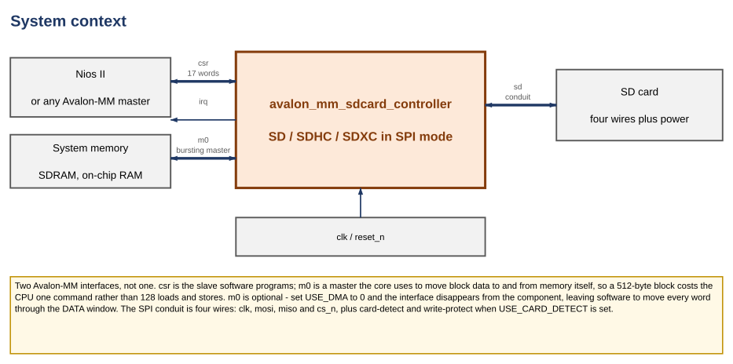
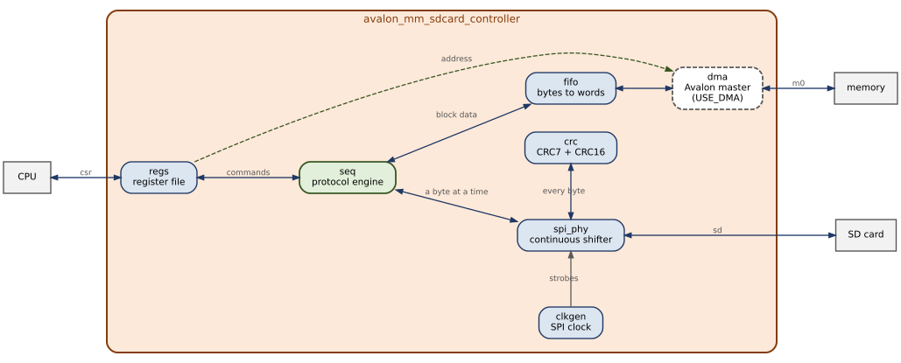
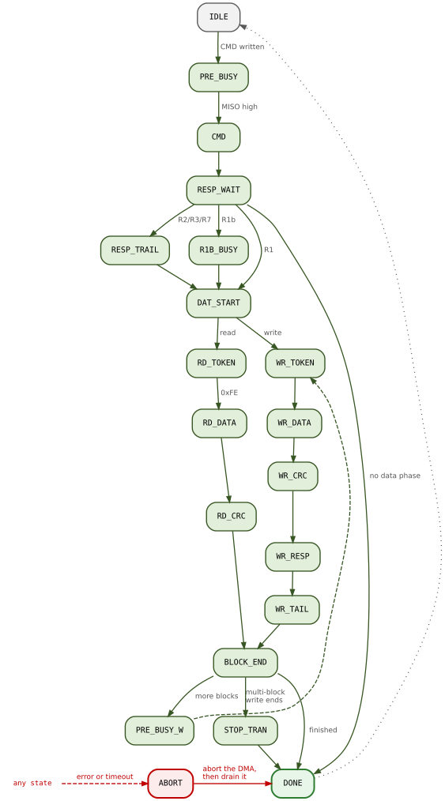
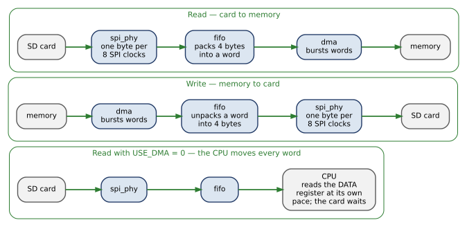
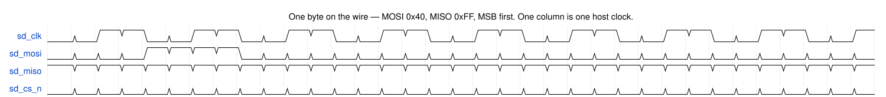
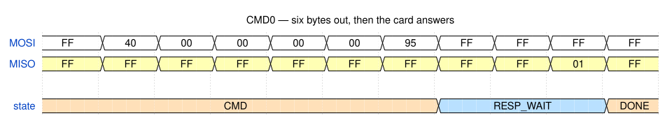
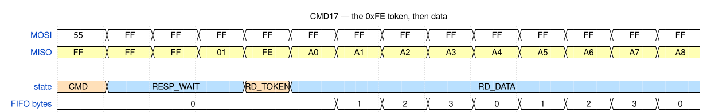
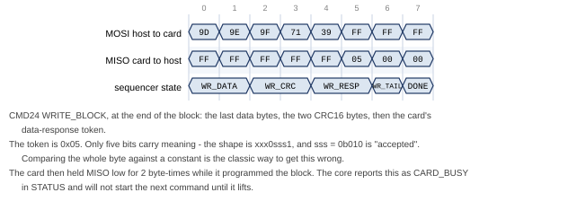
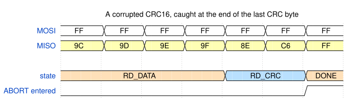

# Avalon-MM SD Card Controller — Block Diagrams

**Core:** `avalon_mm_sdcard_controller` · **Version:** v1.0
**Interface:** SD / SDHC / SDXC in SPI mode
**Status:** simulation only — never run on a board

How the core is put together, and what a transfer looks like on the wire.
For registers, parameters and the driver API, see the user guide.

State names appear here without the `S_` prefix the RTL uses: `RD_TOKEN` in a
figure is `S_RD_TOKEN` in `avalon_mm_sdcard_controller_seq.sv`.

---

## Contents

1. [What it connects to](#1-what-it-connects-to)
2. [Inside the core](#2-inside-the-core)
3. [How a transfer runs](#3-how-a-transfer-runs)
4. [Where the bytes go](#4-where-the-bytes-go)
5. [On the wire](#5-on-the-wire)
6. [Regenerating the figures](#6-regenerating-the-figures)

---

# 1. What it connects to



| Interface | Type | Carries |
|---|---|---|
| `csr` | Avalon-MM slave | The 17 registers software drives |
| `m0` | Avalon-MM master, bursting | Block data, to and from memory |
| `irq` | Interrupt sender | One line |
| `sd` | Conduit | `clk`, `mosi`, `miso`, `cs_n` — plus `cd_n` and `wp_n` if `USE_CARD_DETECT` |

Two Avalon-MM interfaces, not one. `csr` is how software drives the core. `m0`
is how the core moves block data by itself.

That second interface is the difference between one command per block and 256
memory accesses per block. A 512-byte block is 128 words each way; without a
master, the CPU has to move all of them, and it cannot look away while it does —
fall behind and the shifter starves.

`m0` is optional. Set `USE_DMA = 0` and the interface disappears from the
component; software then moves words through the `DATA` register instead. That
configuration is one of the five the regression sweeps, so it is tested rather
than assumed.

---

# 2. Inside the core



Nine RTL files, 3,127 lines.

| Module | Job |
|---|---|
| `pkg` | Register map, bit positions, protocol constants |
| `regs` | The `csr` slave. Read latency 1, one interrupt mask |
| `seq` | The protocol engine — 20 states |
| `spi_phy` | The shifter. Runs continuously, keeps one byte prefetched |
| `clkgen` | Divides `clk` to the SPI rate |
| `crc` | CRC7 on commands, CRC16 on data |
| `fifo` | Word-wide buffer with a byte packer on the card side |
| `dma` | The `m0` master |

The core forks at the sequencer. Block data goes out through the FIFO and the
master; single bytes — commands, responses, tokens — go out through the shifter.

## 2.1 The shifter does not stop

It keeps one byte prefetched, so the next byte is queued before the current one
finishes and the SPI clock never pauses between bytes.

That is worth **16,696 SPI clocks to move 2,048 bytes**, against a floor of
16,384 — **98.1% of line rate**. The regression asserts that cycle count, so a
change that reintroduces an idle clock fails the build rather than quietly
costing 11%.

It also decides how the CRCs are built. A bit-serial CRC needs eight cycles per
byte, which only exist if the shifter pauses. This one does not pause, so both
CRCs take a whole byte at a time.

## 2.2 The FIFO is word-wide, with a packer

Its two ends run at different widths and different rates: the shifter moves one
byte per eight SPI clocks, the master moves four bytes per host cycle.

At the default `FIFO_DEPTH_BYTES = 1024` it holds two blocks, so the DMA can
drain one while the shifter fills the next. At 512 it holds one, the overlap
disappears, and the data path has to refill mid-transfer — which is why 512 is
in the sweep.

---

# 3. How a transfer runs



Read it top to bottom. Every operation is a command; some commands then have a
data phase, which is either the read chain or the write chain, and both rejoin
at `BLOCK_END`.

Error exits are not drawn. Every state has one, and they all go to `ABORT`.

Three states are worth naming, because their purpose is not in their names:

**`PRE_BUSY`** clocks `0xFF` with `CS` high before every command. A card still
programming an earlier block holds `MISO` low, and this is how the core finds
out. It also means the shifter is always already running when a sending state
begins.

**`WR_TAIL`** covers the eight clocks after a data-response token, during which
busy on `MISO` does not yet mean anything. Sample earlier and a card that has
not started looks like a card that has finished.

**`R1B_BUSY`** is only for R1b commands, where the card holds the line until the
operation completes.

`ABORT` does not go straight to `IDLE`. It goes through `DONE`, so the DMA is
told to abort and then allowed to drain. An Avalon master that stops issuing
beats part-way through a burst hangs the interconnect — so giving up on a
transfer takes more care than never starting one.

---

# 4. Where the bytes go



Read and write are mirror images. The third row is the same core with
`USE_DMA = 0`.

In that third case the CPU is on a deadline: nothing else is keeping the buffer
moving, so software that is slow to service the `DATA` register starves the
shifter and the data-phase timeout fires.

That timeout exists because of a bug. `RD_DATA` and `WR_DATA` originally had no
timeout at all, so a starved data phase hung the core until a soft reset. With a
master attached it cannot happen, which is why it survived until the PIO
configuration was first run. The bound is on time **without progress**, so a slow
block never trips it and a stalled one does.

---

# 5. On the wire

Five figures, all cut from one recorded simulation. The bytes, tokens, CRC
values and state names in them were produced by the RTL in this repository.

## 5.1 One byte, at bit level



CPOL = 0, CPHA = 0. `MOSI` changes on the falling edge of `sd_clk`; both ends
sample on the rising edge. This is the one thing a byte-level view cannot show,
and the one to get right when wiring to a real card.

## 5.2 A command and its response



Six bytes out: `0x40 | index`, four argument bytes, then CRC7 shifted up one
with a stop bit in bit 0. Then the host clocks `0xFF` until the card answers.

`N_CR` — the gap before the response — is a **range**, 0 to 8 byte-times, not a
fixed latency. So the core polls for a byte with bit 7 clear rather than waiting
a set time. Here the card took two.

`0x95` is the CRC7 of CMD0 with a zero argument, which is why that constant
appears in every SD initialisation routine ever written.

## 5.3 The start of a block read



After the R1 the card may take as long as it likes, so the core sits in
`RD_TOKEN` clocking `0xFF`. `0xFE` starts the block. Anything with the top four
bits clear is a data error token instead, and lands in `ERR_INFO` rather than
being treated as data.

Watch the FIFO count: it rises as bytes arrive and falls as the DMA drains them,
rather than climbing to 512 and then emptying.

## 5.4 The end of a block write



The data-response token is the trap here. Its shape is `xxx0sss1` — **five bits
of meaning in eight** — so mask with `0x1F` before comparing. Comparing the whole
byte against a constant is the usual way to get this wrong.

Here it is `0x05`: `sss = 010`, data accepted. The card then holds `MISO` low
while it programs the block, which the core reports as `CARD_BUSY`.

## 5.5 A CRC16 that does not match



Nothing on the wire distinguishes a corrupt block from a good one until the
check is done. The core folds the last byte into the running CRC16
combinationally and compares against zero, so the mismatch is known at the end
of the final CRC byte rather than a byte later.

`ABORT` needs a row of its own because it lasts a cycle or two — it raises
`dma_abort`, then routes to `DONE` — so a state row sampled once per byte never
lands on it.

There is no `irq` row because it would be flat high: `DMA_DONE` raised the pin
earlier in the data phase. The pin says something happened; only `IRQ_STATUS`
says what.

---

# 6. Regenerating the figures

```bash
python3 doc/tools/diagrams/build_figures.py   # block diagrams, via Graphviz
./verification/capture.sh                     # record verification/wave.vcd
python3 doc/tools/waveforms/mkwaves.py        # timing figures, via WaveDrom
python3 doc/tools/build_pdf.py all            # typeset both documents
./verification/check_figures.sh               # confirm the tracked SVGs match
```

The block diagrams are Graphviz sources, so the layout is computed rather than
placed by hand. The timing figures are generated from the VCD: change the RTL
and either the figure changes with it, or `mkwaves.py` stops finding the token
or state it is looking for and says which.

Requirements: Graphviz for the block diagrams; Verilator for the capture; Node
plus `npm install wavedrom onml` in `doc/tools/waveforms` for the timing
figures. The tracked SVGs mean none of that is needed just to read the
documents.

---

## Revision history

| Version | Change |
|---|---|
| v1.1 | Block diagrams moved to Graphviz, timing figures to WaveDrom. Register-map figure dropped — it was a table drawn as a picture. |
| v1.0 | First issue. |
