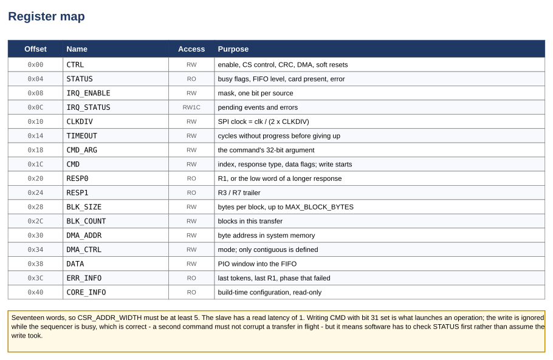

# Avalon-MM SD Card Controller — Block Diagrams and Descriptions

**Core:** `avalon_mm_sdcard_controller` · **Version:** v1.0
**Interface:** SD / SDHC / SDXC in SPI mode
**Status:** simulation only — never run on a board

Every figure in this document is generated, not drawn. The block diagrams come
from `doc/tools/diagrams/build_figures.py`; the timing figures are cut out of a
real VCD by `doc/tools/waveforms/mkwaves.py`, from a simulation recorded by
`verification/wave_capture_tb.sv`. That is deliberate. A hand-drawn timing
diagram cannot be checked against anything and quietly becomes fiction the first
time the RTL changes, and SPI-mode SD is exactly the protocol where that does
damage: it is full of details a plausible-looking drawing gets wrong.

---

## Contents

1. [System context](#1-system-context)
2. [Internal structure](#2-internal-structure)
3. [Register map](#3-register-map)
4. [Sequencer states](#4-sequencer-states)
5. [Where a block's bytes go](#5-where-a-blocks-bytes-go)
6. [On the wire](#6-on-the-wire)
7. [Revision history](#revision-history)

---

# 1. System context

The core presents four interfaces to Platform Designer:

| Interface | Type | Purpose |
|---|---|---|
| `csr` | Avalon-MM slave, 32-bit, 17 words | The register file software drives |
| `m0` | Avalon-MM master, bursting | Moves block data to and from memory. Present only when `USE_DMA = 1` |
| `irq` | Interrupt sender | One line, one mask |
| `sd` | Conduit | `clk`, `mosi`, `miso`, `cs_n`, plus `cd_n` and `wp_n` when `USE_CARD_DETECT = 1` |

Two Avalon-MM interfaces rather than one is the design decision that matters
most here. A controller with only a slave makes the CPU move every byte: 512
bytes is 128 loads and 128 stores per block, and at any useful SPI clock the CPU
cannot look away — a missed service window starves the shifter. With `m0` the
CPU writes a command and comes back when the interrupt arrives.

`m0` is still optional, because "an ordinary Avalon master would do" is a real
requirement in small systems and the interface costs logic. Setting `USE_DMA` to
0 removes it from the component entirely — not just tying it off — and software
moves words through the `DATA` window instead. That configuration is tested, not
assumed: it is one of the five the regression sweeps, and it is the only one in
which the data-phase stall timeouts can be reached at all.


---

# 2. Internal structure

Nine RTL files, 3,127 lines.

| Module | What it does |
|---|---|
| `_pkg` | Register map, bit positions, protocol constants, response and phase enumerations |
| `_regs` | The `csr` slave. Read latency 1, one interrupt mask, write-1-to-clear status |
| `_seq` | The protocol engine: 20 states, command framing, token recognition, timeouts |
| `_spi_phy` | The shifter. Continuous, with a one-deep prefetch |
| `_clkgen` | Divides `clk` to the SPI rate and emits rising and falling strobes |
| `_crc` | CRC7 for command frames, CRC16 for data blocks, both byte-wise |
| `_fifo` | Word-wide store with a byte packer on the card side |
| `_dma` | The `m0` master. Bursts, and can abort legally |


## 2.1 Why the shifter never stops

The shifter runs continuously for the whole of a transfer and keeps one byte
prefetched, so the next byte is queued before the current one finishes and the
SPI clock does not pause between bytes. Measured, that is **16,696 SPI clocks to
move 2,048 bytes** against a theoretical floor of 16,384 — **98.1% of line
rate**. The regression asserts the cycle count rather than merely reporting it,
because a performance number nobody checks is a number that silently regresses.

This is also why the CRC units are byte-wise rather than bit-serial. A
bit-serial CRC has eight cycles to do its work only if the shifter pauses
between bytes; one that does not pause needs the whole byte folded in at once.

## 2.2 Why the FIFO is word-wide with a packer

The two ends of the buffer run at different widths and different rates. The
shifter moves one byte per eight SPI clocks; the master moves four bytes per
host cycle. A byte-wide FIFO would make the master do four accesses per word, a
word-wide one without a packer cannot talk to the shifter at all.

Sizing it at two blocks rather than one is what lets the DMA drain block N while
the shifter is receiving block N+1. `FIFO_DEPTH_BYTES = 512` — one block — is a
supported configuration and one of the five the regression sweeps, precisely
because that overlap disappears and the refill path has to work mid-transfer.

---

# 3. Register map

Seventeen 32-bit words, so `CSR_ADDR_WIDTH` must be at least 5. Offsets, bit
positions and reset values are given in full in the user guide, section 5.

Two things about this map are worth stating here because they are behaviours
rather than layout:

**Writing `CMD` with bit 31 set is what launches an operation.** The write is
ignored while the sequencer is busy. That is correct — a second command must not
corrupt a transfer in flight — but it means software cannot assume the write
took. Polling afterwards does not catch it either: busy is already clear, so the
poll returns immediately for a command that never happened. Check `STATUS`
first.

**`ERR_INFO` records what failed, not merely that something did.** It holds the
last data-response token, the last R1 byte, the last data error token, and which
phase the timeout occurred in. "The card never answered" and "the card answered
and then never finished" need different recovery, and only the phase field
distinguishes them.



---

# 4. Sequencer states

Twenty states. The figure draws the normal path; error exits are not drawn,
because every state has one and they all converge on `S_ABORT` — which is the
point of having it.

What matters is where `S_ABORT` goes. Not straight to `S_IDLE`, but through
`S_DONE`, so the DMA is told to abort and then allowed to drain. An Avalon
master that simply stops issuing beats part-way through a burst hangs the
interconnect; abandoning a transfer is more work than not starting one.


Three states exist for reasons that are not obvious from their names:

- **`S_PRE_BUSY`** free-runs `0xFF` with `CS` high before every command. A card
  that is still programming a previous block holds `MISO` low, and clocking it
  is how you find out. A useful side effect: the shifter is *always already
  running* when a sending state is entered, which the assertion suite depends
  on and which `verification/check_assertions_fire.sh` documents — one fault it
  tried to inject turned out to be unreachable for exactly this reason.
- **`S_WR_TAIL`** covers the eight clocks after a data-response token during
  which busy on `MISO` means nothing yet. Sampling too early reads a card that
  has not begun as a card that has finished.
- **`S_R1B_BUSY`** is entered only for R1b commands, where the response is
  followed by the card holding the line until the operation completes.

---

# 5. Where a block's bytes go

The read path and the write path are mirror images, and the third row is the
same core with `USE_DMA = 0`.

In PIO mode the CPU is on a deadline. With no master keeping the buffer moving,
software that is slow to service the `DATA` window starves the shifter, and the
data-phase stall timeout fires. That timeout is not decoration: it was added
after a configuration sweep found that `S_RD_DATA` and `S_WR_DATA` had no
timeout at all, so a starved data phase hung the core until a soft reset. With a
master attached the case cannot arise, which is exactly why it survived until
the PIO configuration was actually run.

The timeout measures **time without progress**, not total duration, so a long
block never trips it and a stalled one does.


---

# 6. On the wire

These five figures are cut from a single recorded simulation. The bytes,
tokens, CRC values and state names in them were produced by the RTL in this
repository; nothing is illustrative.

## 6.1 One byte, at bit level


The one thing a byte-level view cannot express, and the one an integrator has to
get right: CPOL = 0, CPHA = 0. `MOSI` changes on the falling edge of `sd_clk`
and both ends sample on the rising edge.

## 6.2 A command frame and its response


Six bytes out — `0x40 | index`, four argument bytes, then CRC7 shifted up one
with the stop bit in bit 0 — and then the host clocks `0xFF` until the card
answers.

`N_CR` is a **range**, not a latency: the specification allows the response
anywhere from 0 to 8 byte-times after the frame, so the core polls for a byte
with bit 7 clear rather than waiting a fixed time. In the recording the card
took two.

`0x95` is the CRC7 of CMD0 with a zero argument, which is why that constant
appears in every SD initialisation routine ever written.

## 6.3 The start of a block read


After the R1 the card may take as long as it likes, so the core sits in
`S_RD_TOKEN` clocking `0xFF` until a token arrives. `0xFE` starts a block;
anything with the top four bits clear is a data error token instead, and is
reported in `ERR_INFO` rather than treated as data.

The `FIFO bytes` row shows why the DMA matters: the count rises as bytes land
and falls as the master drains them, in parallel, rather than climbing to 512
and then emptying.

## 6.4 The end of a block write


The data-response token is the trap in the write path. Its shape is `xxx0sss1`
— **five bits of meaning in eight** — and comparing the whole byte against a
constant is the classic way to get this wrong. In the recording it is `0x05`:
`sss = 010`, data accepted.

The card then holds `MISO` low while it programs the block. The core reports
that as `CARD_BUSY` in `STATUS` and will not start the next command until it
lifts.

## 6.5 A block whose CRC16 does not match


Nothing on the wire distinguishes a corrupt block from a good one until the
check is done. The core folds the final byte into the running CRC16
*combinationally* and compares against zero, so the mismatch is known at the end
of the last CRC byte rather than a byte later. Reading the register instead
checks the CRC one byte early, which fails on every block, always, and looks
exactly like a wiring or polynomial fault.

The `S_ABORT entered` row has to exist because `S_ABORT` is transient — it
raises `dma_abort` and routes on to `S_DONE` within a cycle or two, so a
byte-level state row never lands on it and the figure would otherwise say the
error path was not taken.

Note also what the figure does *not* show. There is no `irq` row, because it
would be a flat 1: `DMA_DONE` has already raised the pin during the data phase.
The pin says something happened; only `IRQ_STATUS` says what.

---

## Regenerating these figures

```bash
python3 doc/tools/diagrams/build_figures.py      # the block diagrams
./verification/capture.sh                        # record wave.vcd
python3 doc/tools/waveforms/mkwaves.py           # the timing figures
python3 doc/tools/check_facts.py                 # re-derive every number above
```

`mkwaves.py` fails loudly rather than silently producing a wrong picture: if a
scenario no longer contains the token or state it is looking for, it exits with
an error naming what it could not find.

---

## Revision history

| Version | Change |
|---|---|
| v1.0 | First issue. Five block diagrams, five timing figures generated from a recorded simulation. |
