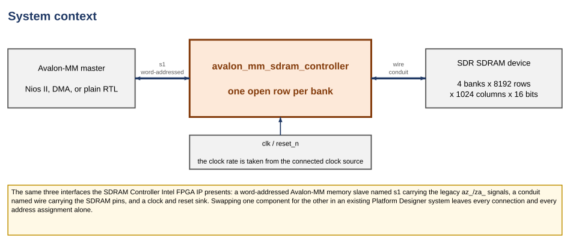
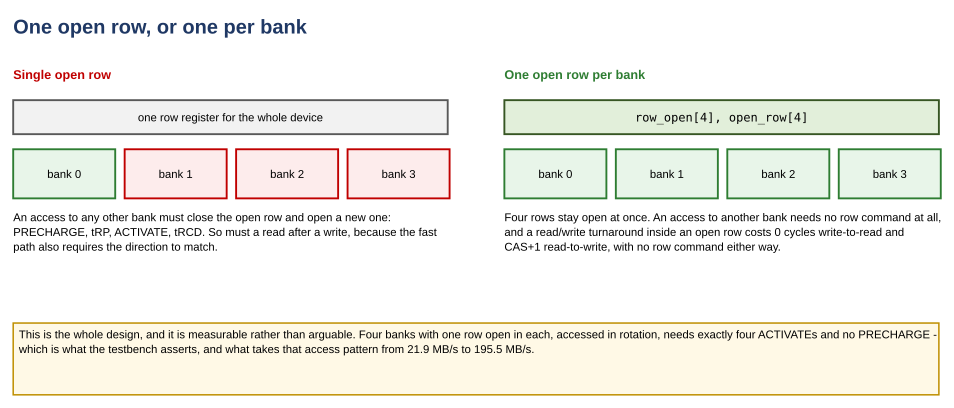
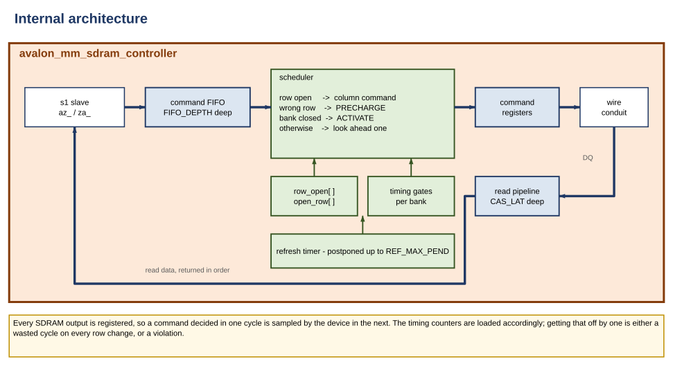
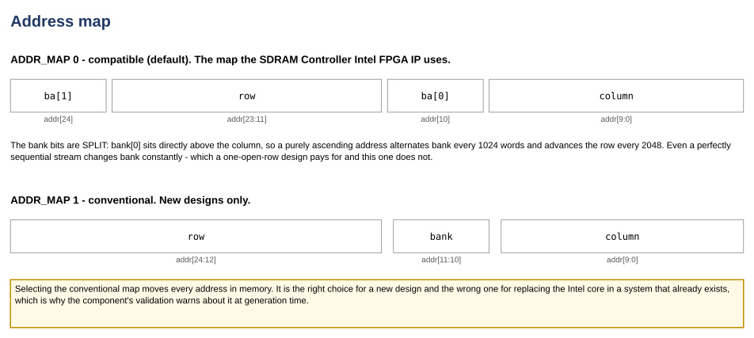

# Avalon-MM SDRAM Controller — Block Diagrams and Descriptions

**Core version 1.0 · Document version 1.0 · August 2026**

Four figures and what they mean. The companion document is the
[User Guide](avalon_mm_sdram_controller_user_guide.md), which covers
parameters, signals and integration.

Every figure here is generated by `doc/tools/diagrams/build_figures.py` and
stored as SVG. Nothing is hand-drawn, so nothing can quietly disagree with the
RTL without `doc/tools/check_facts.py` noticing.

## Contents

1. System context
2. One open row, or one per bank
3. Internal architecture
4. Address map

---

# 1. System context



**Figure 1. System context**

The controller sits between an Avalon-MM master and an SDR SDRAM device. It
presents three interfaces, and they are deliberately the same three the SDRAM
Controller Intel FPGA IP presents:

| Interface | Kind | What it carries |
|---|---|---|
| `s1` | Avalon-MM slave, word-addressed | `az_addr`, `az_be_n`, `az_cs`, `az_data`, `az_rd_n`, `az_wr_n`, `za_data`, `za_valid`, `za_waitrequest` |
| `wire` | conduit | The SDRAM pins: `zs_addr`, `zs_ba`, `zs_cas_n`, `zs_cke`, `zs_cs_n`, `zs_dq`, `zs_dqm`, `zs_ras_n`, `zs_we_n` |
| `clk` / `reset` | clock and reset sink | One clock domain. Nothing here crosses domains |

Because the interfaces match, replacing the Intel component with this one in an
existing Platform Designer system leaves every connection and every address
assignment alone.

> **Note:** The clock rate is not a parameter. Platform Designer takes it from
> the clock source the component is connected to and passes it to the HDL, which
> converts every device timing against it. A controller configured for 100 MHz
> and clocked at 143 is not a mistake that can be made here.

---

# 2. One open row, or one per bank



**Figure 2. Row tracking**

This is the entire design, and the reason the core exists.

An SDRAM bank has one row buffer. Reading or writing a location requires that
location's row to be **open** — ACTIVATEd into the buffer. Opening a different
row in the same bank means PRECHARGE, then tRP, then ACTIVATE, then tRCD; on
the DE10-Lite's part at 100 MHz that is 2 + 2 + 2 = 6 dead cycles before the
next access can even be issued.

A device has **four** banks and therefore four row buffers. A controller may
keep a row open in every one of them at the same time.

The controller this replaces keeps one. Its fast path is:

```verilog
assign pending = csn_match && rnw_match && bank_match && row_match && !f_empty;
```

so an access falls out of it — into a full row cycle — if the bank differs, if
the row differs, **or if the direction differs**. That last condition is the
expensive one: a read following a write inside a single open row, which the
device can do back to back, costs a full PRECHARGE/ACTIVATE pair.

This core tracks `row_open[4]` and `open_row[4]`, and treats a turnaround as
the datasheet describes it: 0 cycles write→read, CAS+1 read→write, no row
command either way.

> **Caution:** A per-bank design needs two timing parameters a single-row design
> never encounters. **tRAS** bounds how soon a row may be closed after opening,
> and **tRRD** bounds how soon a second bank may be activated after the first.
> Neither can be violated by a controller that only ever has one row open, and
> both can be by this one. They are checked in simulation by
> `tb/sdram_timing_check.sv`.

---

# 3. Internal architecture



**Figure 3. Internal architecture**

**Command FIFO.** Accepted transfers are buffered `FIFO_DEPTH` deep. The buffer
does two jobs: it decouples the master from row-change stalls, and it gives the
scheduler something to look at beyond the access it is currently serving.

Each entry is stored **already decoded** into bank, row and column, and the
buffer's output is **registered**: the scheduler reads a flip-flop, not the
array's multiplexer. Both exist for timing rather than function. With the head
taken combinationally, the read pointer, a `FIFO_DEPTH`-way multiplexer, the
address decode and the entire priority chain below all shared one cycle, and
f_MAX was 83 MHz against a 100 MHz target. Splitting the multiplexer from the
scheduler with a register — selecting between the pre-read candidate entries
*after* they resolve, rather than computing an index first and indexing with it
— reached 101 MHz for no change in cycle counts.

The **row match** is registered for the same reason and by the same rule. "Is
the row this access wants the row this bank has open?" is a `ROW_BITS`
equality followed by a bank-way multiplexer, and with both inside the
scheduler loop the MAX 10 build missed 100 MHz by 0.030 ns. Every operand is a
register, so the answer is computed one cycle ahead from the values the
registers are about to take, and the scheduler reads a bit: 104.8 MHz, again
for no change in cycle counts.

The rule both changes follow is the same, and it is easy to get wrong: the
late-arriving signals — `f_pop`, and the bypass selects that depend on it
through `za_waitrequest` — may only **select between answers that have already
settled**. A first attempt at the row match compared against the selected
entry instead, which put the equality downstream of the whole priority chain
and cost 6 MHz rather than gaining any.

**Scheduler.** One decision per cycle, in priority order:

| Condition | Command issued |
|---|---|
| The head's row is open, tRCD met, and the bus is free in that direction | READ or WRITE, and the entry is retired |
| The head's bank is open on the wrong row, and tRAS/tWR permit | PRECHARGE |
| The head's bank is closed, and tRP/tRC/tRRD permit | ACTIVATE |
| None of the above, and `LOOKAHEAD` is on | PRECHARGE or ACTIVATE for the *next* entry, if it is in a different bank |

**Bank state.** `row_open[]` and `open_row[]` are the design's central claim.
If they ever disagree with the commands actually issued, every subsequent
access lands somewhere else — silently. The testbench maintains an independent
shadow of this state, rebuilt from the command bus, and asserts the two match.

**Timing gates.** A down-counter per bank for tRCD, tRAS, tRP, tRC and tWR, and
global counters for tRRD, tRFC and the read/write bus turnaround. Every one is
derived from a picosecond parameter and the clock rate, inside the HDL.

**Refresh.** A timer accumulates outstanding refreshes. They are spent when the
buffer is empty — where they cost nothing — or forced through once
`REF_MAX_PEND` have accumulated. JEDEC permits up to 8 postponed.

**Read return.** A shift register `CAS_LAT` deep carries a marker; the data
itself is captured straight off the bus. No address is stored, because SDRAM
returns read data strictly in order.

> **Note:** Every SDRAM output is registered. A command decided in cycle *k* is
> sampled by the device on edge *k+1*, so the timing counters are loaded with
> (cycles − 1). Getting that off by one is either a wasted cycle on every row
> change, or a violation — and it is invisible in a functional simulation.

---

# 4. Address map



**Figure 4. Address map**

`ADDR_MAP 0`, the default, reproduces the layout the Intel core uses:

| Field | Bits, at the default geometry |
|---|---|
| `bank[1]` | `addr[24]` |
| `row` | `addr[23:11]` |
| `bank[0]` | `addr[10]` |
| `column` | `addr[9:0]` |

The bank bits are **split**. `bank[0]` sits directly above the column, so an
ascending address alternates bank every 1024 words and advances the row every
2048. Even a perfectly sequential stream changes bank constantly — which is
precisely the traffic a one-open-row design handles badly and a per-bank design
does not notice.

`ADDR_MAP 1` is the conventional `{row, bank, column}`.

> **Caution:** Selecting the conventional map moves every address in memory.
> It is the right choice for a new design and the wrong one for replacing the
> Intel core in a system that already exists. The Platform Designer component
> emits a warning when it is selected.

---

## Revision history

| Document version | Core version | Date | Change |
|---|---|---|---|
| 1.0 | 1.0 | August 2026 | First release |
