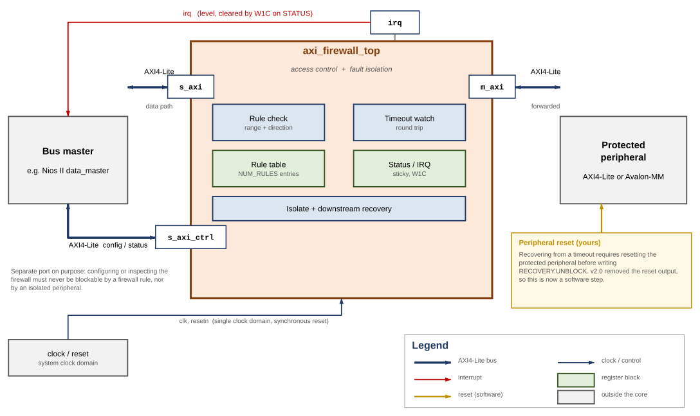
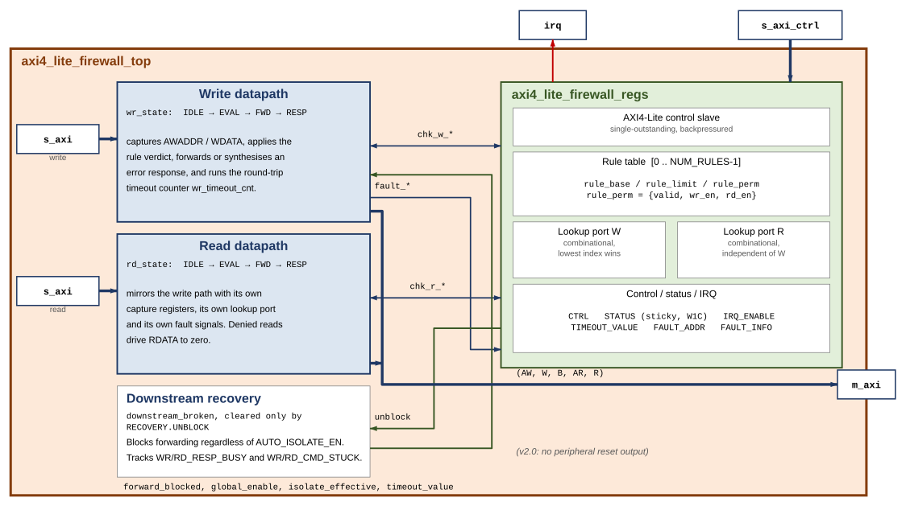
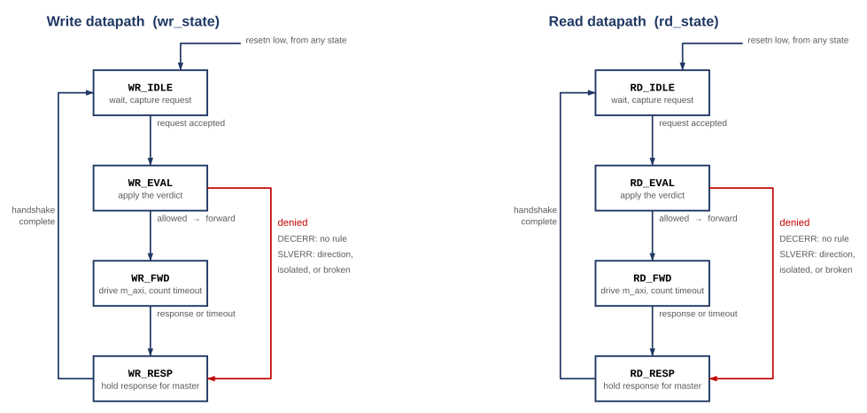
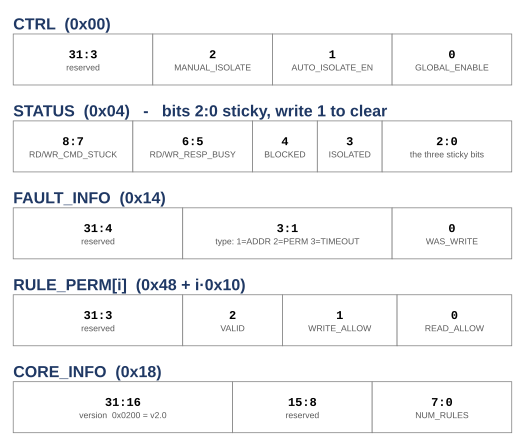

# AXI4-Lite Firewall

## Block Diagrams and Descriptions

**Core:** `altera_axi4_lite_firewall`
**Version:** 2.0 — `CORE_INFO` reports `0x0200`
**Last updated:** August 2026

---

A synthesisable SystemVerilog core that sits between a bus master and a
peripheral you want to protect. Every transaction is checked against a
software-programmable table of address ranges before it is forwarded, and every
forwarded transaction is watched by a timeout so a wedged peripheral can never
hang the master.

There is no stock AXI firewall in the Altera IP catalog, so this is a
from-scratch component: RTL, Platform Designer wrapper, self-checking
testbench, SystemVerilog assertions, and both a Questa and a licence-free
Verilator flow.

This document is the architectural companion to the
[user guide](axi4_lite_firewall_user_guide.md). The user guide tells you how to
use the core; this one shows you what is inside it and why.

---

## Contents

1. [System context](#1-system-context)
2. [Internal architecture](#2-internal-architecture)
3. [Datapath state machines](#3-datapath-state-machines)
4. [Register map and rule table](#4-register-map-and-rule-table)
5. [Verification status](#5-verification-status)

---

# 1. System context

Where the core sits, and what must be connected to it.

The core is a bump-in-the-wire between one master and one protected peripheral.
It enforces an allow-list on every transaction and guarantees the master always
gets a response, even when the peripheral stops answering.

Each transaction's address is compared against a table of ranges, each with
independent read and write permission. The lowest-index valid rule containing
the address wins; ranges need not be disjoint, so put more specific rules at
lower indices. Default-deny applies:

**Table 1. Default-Deny Response Encoding**

| Condition | Response |
|---|---|
| No rule matches | `DECERR` |
| Rule matches, wrong direction | `SLVERR` |
| Blocked while isolated | `SLVERR` |

A denied read returns zeroed `RDATA` rather than stale bus data, so a rejected
read cannot leak the result of an earlier permitted one.

**Figure 1. System Context**



## 1.1 Fault isolation

Every forwarded transaction is watched by a timeout covering the whole round
trip, address issue to response. That catches a peripheral that never raises
`AWREADY`/`ARREADY` as well as one that accepts and then goes quiet. On expiry
the core answers `SLVERR` upstream immediately, so the master never hangs, and
latches an internal broken state that blocks all further forwarding until
software acknowledges the fault.

## 1.2 Why the control port is separate

`s_axi_ctrl` is a physically distinct AXI4-Lite slave. Recovery requires
writing `STATUS`, and if that write had to pass through the firewall's own rule
check, or through an isolated peripheral, a fault would be unrecoverable. Both
ports may be driven by the same master.

## 1.3 Recovery is a software sequence

```
ack the fault  →  poll the busy bits (bounded)  →  RESET THE PERIPHERAL
               →  write RECOVERY.UNBLOCK
```

> **Caution:** `UNBLOCK` is what withdraws a stuck `VALID`. Skipping the reset
> makes that a protocol violation on a live bus: measured, 1 of 25 timing
> offsets then mis-attributes a stale response, against 0 of 25 when the
> sequence is followed.

Version 2.0 removed the `m_axi_resetn` output the core used to drive, so
resetting the protected peripheral is now the integrator's job. It must be
reachable from software — a Platform Designer reset bridge under software
control, or a PIO output, both work.

## 1.4 Interface summary

**Table 2. Interface Summary**

| Interface | Connects to |
|---|---|
| `s_axi` | The master being policed |
| `m_axi` | The protected peripheral |
| `s_axi_ctrl` | Rule table, status, IRQ enable |
| `irq` | A CPU interrupt input |
| `clk`, `resetn` | Single clock domain, synchronous reset |

> **Note:** There is no per-master filtering. AXI4-Lite carries no ID field, so
> the core cannot tell one master from another. It polices *what* is accessed,
> not *who* is accessing it.

---

# 2. Internal architecture

Inside `axi_firewall_top`: two independent datapaths, one register block, one
recovery controller.

The datapaths are fully independent — separate FSMs, capture registers, lookup
ports and fault pulses — so a read and a write can be in flight at once. Only
`FAULT_ADDR` and `FAULT_INFO` are shared; if both fault in the same cycle the
write side wins, a deterministic tie-break.

`chk_*_` is the rule-lookup bundle: `chk_*_addr` out to the register block,
`chk_*_match` and `chk_*_allow` back, all combinational within one cycle. Each
datapath has its own port, so neither ever waits on the other for a verdict.

Both datapaths follow the same four-state shape. IDLE waits for a request and captures
it; EVAL applies the verdict in a single cycle; FWD drives the master side and
runs the timeout counter; RESP holds the response until the master accepts it.

EVAL is where policy is decided, in strict priority order:

1. Forwarding blocked → `SLVERR`
2. Global bypass (`CTRL.GLOBAL_ENABLE` clear) → forward unconditionally
3. No rule match → `DECERR`
4. Rule matched but direction denied → `SLVERR`
5. Otherwise → forward

**Figure 2. Internal Architecture**



## 2.1 The register block

`axi_firewall_regs` owns the rule table and all software-visible state, and
exposes two independent purely combinational lookup ports so both datapaths get
an answer in the same cycle without contending.

The lookup is a priority chain over `NUM_RULES` entries. It is the likeliest
critical path, and the standard fix if it limits f<sub>MAX</sub> is to register
it with an extra pipeline stage.

## 2.2 Timeout and recovery

On expiry the core reports `SLVERR` upstream, latches `downstream_broken`, and
deliberately leaves any asserted `m_axi_*VALID` asserted.

> **Caution:** AXI requires `VALID` to hold until `READY`; withdrawing it can
> wedge the interconnect between the core and the peripheral, not just the
> peripheral.

The stuck `VALID` is dropped only by `RECOVERY.UNBLOCK`, which means software
has reset the peripheral and its AXI state is gone. `STATUS` exposes
`RESP_BUSY` (the peripheral owes a response) and `CMD_STUCK` (it never accepted
the command) so a driver can sequence this.

**Bound the busy poll.** A peripheral that accepted a command and then died
owes a response forever, so an unbounded poll hangs precisely when recovery
matters most. A transaction arriving while blocked is rejected, not stalled, so
drivers need a retry path.

`downstream_broken` is independent of `CTRL.AUTO_ISOLATE_EN`. That bit governs
only the visible `ISOLATED` status; blocking after a timeout is required for
protocol safety and happens either way.

## 2.3 Key internal signals

**Table 3. Key Internal Signals**

| Signal | Meaning |
|---|---|
| `chk_w_addr` / `chk_r_addr` | Address presented to the rule lookup, one port per datapath |
| `chk_*_match` | Some valid rule contains this address; low means `DECERR` |
| `chk_*_allow` | That rule permits this direction; low means `SLVERR` |
| `global_enable` | `CTRL` bit 0. Low is bypass: forward everything unchecked |
| `isolate_effective` | `MANUAL_ISOLATE` or the auto-isolate latch |
| `downstream_broken` | Latched by a timeout, cleared only by `RECOVERY.UNBLOCK` |
| `forward_blocked` | `isolate_effective \| downstream_broken` — the EVAL gate |
| `unblock` | Single-cycle pulse from a write to `RECOVERY` |

---

# 3. Datapath state machines

Both FSMs are enum-typed, so Questa names the states in its coverage report.
All 14 transitions are covered by the test suite.

**IDLE** waits for a request. The write path needs both `AWVALID` and `WVALID`
before asserting either `READY` — a slave may always add wait states, so this
is compliant and keeps one simple pattern. Address, protection bits, data and
strobes are captured on entry to EVAL.

**EVAL** is always one cycle. The rule lookup result for the captured address is
already available combinationally, so the verdict costs no extra cycle. If the
downstream is blocked the answer is `SLVERR` — v2.0 removed the reset pulse and
with it the window in which arrivals were stalled instead.

**FWD** drives the master side and runs the timeout counter. The counter starts
when forwarding starts and covers the whole round trip, so a peripheral that
never raises `AWREADY` is caught by the same mechanism as one that accepts and
then goes silent.

**RESP** asserts the response and holds it, with the payload stable, until the
master's `READY` arrives.

The write and read machines are structurally identical but fully separate, each
with its own capture registers and lookup port. A denied read drives `RDATA` to
zero before responding, so it cannot return stale data from an earlier
permitted read.

> **Caution:** On a timeout, `m_axi_*VALID` is deliberately **not** withdrawn.
> The FSM leaves FWD and answers the master, but the master-side `VALID` stays
> asserted until software writes `RECOVERY.UNBLOCK` — the one point where
> dropping it is legitimate, because software has just reset the peripheral and
> its protocol state no longer means anything.

**Figure 3. Datapath State Machines**



## 3.1 Response encoding

**Table 4. Response Encoding**

| Condition | Response |
|---|---|
| Allowed, peripheral answers | As returned by the peripheral |
| No valid rule matches | `DECERR` |
| Matched, direction denied | `SLVERR` |
| Blocked while isolated | `SLVERR` |
| Peripheral timed out | `SLVERR` |

A transaction blocked because the core is isolated returns `SLVERR` but sets no
status bit and raises no interrupt. Only genuine violations and timeouts are
logged, so a burst of rejected traffic during isolation cannot bury the fault
that caused it.

## 3.2 Latency

Measured against a zero-wait-state peripheral, counting clock edges from
request assertion to response valid:

**Table 5. Latency, Zero-Wait-State Peripheral**

| Operation | Cycles |
|---|---|
| Single write | 6 |
| Single read | 6 |

The suite fails if either exceeds 8, so the figure cannot silently rot. Cost is
per transaction and does not amortise — the core is single-outstanding and
non-pipelined.

## 3.3 FSM transition coverage

Questa 2024.1, from the version 2.0 regression.

**Table 6. FSM Transition Coverage**

| Transition | Write FSM | Read FSM | Exercised by |
|---|---|---|---|
| IDLE → EVAL | 23 | 23 | Every transaction reaching the core |
| EVAL → FWD | 17 | 16 | Every permitted transaction |
| EVAL → RESP | 5 | 6 | Denied, out-of-range and blocked transactions |
| EVAL → IDLE | 1 | 1 | Reset asserted during EVAL |
| FWD → RESP | 14 | 13 | Normal completion and timeout |
| FWD → IDLE | 3 | 3 | Reset asserted during FWD |
| RESP → IDLE | 19 | 19 | Every completed response |

---

# 4. Register map and rule table

All registers are 32 bit and word aligned on `s_axi_ctrl`. Reset values are
shown; the core comes up secure by default.

## 4.1 Fixed registers

**Table 7. Fixed Registers**

| Offset | Name | Access | Reset |
|---|---|---|---|
| 0x00 | `CTRL` | R/W | 0x3 (enabled, auto-isolate on) |
| 0x04 | `STATUS` | R / W1C | 0x0 |
| 0x08 | `IRQ_ENABLE` | R/W | 0x7 (all enabled) |
| 0x0C | `TIMEOUT_VALUE` | R/W | all ones (effectively disabled) |
| 0x10 | `FAULT_ADDR` | R | 0x0 |
| 0x14 | `FAULT_INFO` | R | 0x0 |
| 0x18 | `CORE_INFO` | R | version (0x0200) and `NUM_RULES` |
| 0x1C | `RECOVERY` | W | bit 0 `UNBLOCK`, self-clearing |

## 4.2 Rule table

**Table 8. Rule Table**

| Offset | Name | Description |
|---|---|---|
| 0x40 + i·0x10 | `RULE_BASE[i]` | Inclusive base address |
| 0x44 + i·0x10 | `RULE_LIMIT[i]` | Inclusive top address |
| 0x48 + i·0x10 | `RULE_PERM[i]` | Permissions and valid bit |

`i` runs 0 to `NUM_RULES − 1`. With the default 8 rules the table spans
0x40–0xBF. `CTRL_ADDR_WIDTH` must be wide enough to reach the whole table; a
validation callback in `axi_firewall_hw.tcl` enforces this, because an
undersized control port silently makes high-index rules unreachable.

## 4.3 Bit fields

**Figure 4. Register Bit Fields**



## 4.4 Programming model

Bring-up is: program the rules, set a timeout, enable interrupts. The core is
secure by default — `GLOBAL_ENABLE` resets to 1 and the rule table resets
empty, so with no configuration at all every transaction is denied rather than
passed.

> **Note:** `TIMEOUT_VALUE` resets to all ones, which is effectively no timeout.
> Set it to a real round-trip budget for your clock and peripheral, or fault
> isolation will not trigger in any useful time.

### Reconfiguring a live rule

A rule is three registers, so updating one that is currently `VALID` leaves a
window where `BASE` is new but `LIMIT` is still old. Clear `VALID` first —
unnecessary at init, since `VALID` is 0 out of reset:

```
write RULE_PERM[i]  = 0
write RULE_BASE[i], RULE_LIMIT[i]
write RULE_PERM[i]  = perms | VALID
```

## 4.5 Interrupt handling

`irq` is a level interrupt, asserted while any enabled sticky `STATUS` bit is
set. Clear at the source by writing 1 to the relevant bit; there is no separate
acknowledge register. This is the standard memory-mapped-peripheral idiom and
works directly with the Nios II HAL ISR pattern.

`FAULT_ADDR` and `FAULT_INFO` capture the most recent fault of any type. If a
read and a write fault in the same cycle, both sticky bits set correctly but the
capture registers take the write side.

> **Caution:** Clearing `TIMEOUT_ERROR` is not enough on its own. It also
> releases the auto-isolate latch. What it does **not** do, as of v2.0, is
> reopen the downstream — that takes an explicit `RECOVERY.UNBLOCK` after
> software has reset the peripheral. A v1.x driver stops here and then sees
> every access return `SLVERR`.

## 4.6 Control port behaviour

`s_axi_ctrl` is single-outstanding and backpressures correctly: `AWREADY` and
`WREADY` are withheld while a `BVALID` is unacknowledged, and `ARREADY` while an
`RVALID` is. A driver that issues one access at a time sees no difference; one
that pipelines simply waits.

Before v1.2 the port asserted `READY` on `VALID` arriving without checking
whether the previous response had been accepted. A pipelined second access got
its handshake taken, was silently dropped, and never produced a response.
Measured before the fix: two writes produced one response. After: two for two.

---

# 5. Verification status

Questa 2024.1, Verilator 5.48 and slang 11, against the version 2.0 sources.

**Table 9. Verification Results**

| Metric | Result |
|---|---|
| Self-checking tests | 103 / 103 |
| Assertions | 14 / 14 |
| Cover directives | 6 / 6 |
| FSM states | 8 / 8 |
| FSM transitions | 14 / 14 |
| `m_axi` protocol violations | 0 |

Every assertion has a non-zero non-vacuous pass count.

## 5.1 Not yet verified

Quartus analysis of the `_hw.tcl` component, synthesis results (logic element
count, f<sub>MAX</sub>), and behaviour inside a generated Platform Designer
interconnect. See Section 8.4 of the
[user guide](axi4_lite_firewall_user_guide.md) for the full list.

The rule-table decode is checked by lint across nine parameter configurations,
which proves it elaborates — not that it works. That is exactly where an
off-by-one would hide, which is why the functional suite programs and reads
back every rule slot.
