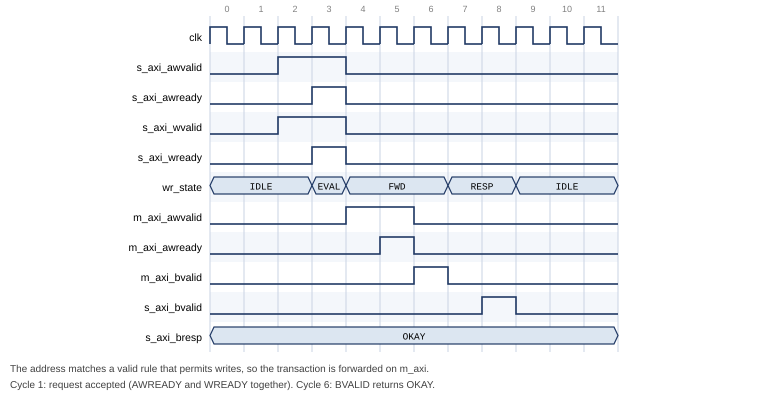
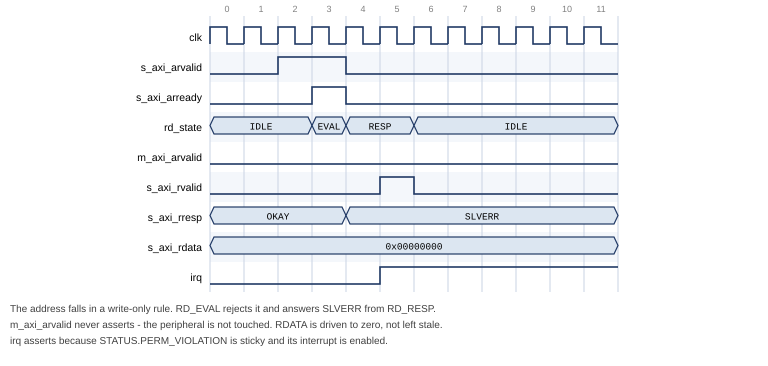
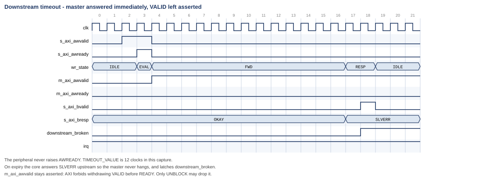
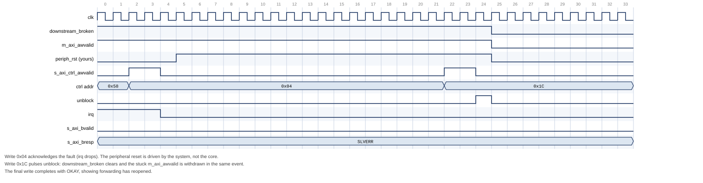

# AXI4-Lite Firewall IP Core

## User Guide

**Core:** `altera_axi4_lite_firewall`
**Version:** 2.0
**Document version:** 1.0
**Last updated:** August 2026

---

Subscribe to changes by watching the repository. Send feedback by opening an
issue against `monkstein88/altera-ip-cores`.

---

## Contents

1. [About the AXI4-Lite Firewall IP Core](#1-about-the-axi4-lite-firewall-ip-core)
   1.1 [Features](#11-features)
   1.2 [Device Family Support](#12-device-family-support)
   1.3 [Resource Utilization](#13-resource-utilization)
   1.4 [Release Information](#14-release-information)
2. [Getting Started](#2-getting-started)
   2.1 [Installing the IP Core](#21-installing-the-ip-core)
   2.2 [Adding the Core to a Platform Designer System](#22-adding-the-core-to-a-platform-designer-system)
   2.3 [Required Connections](#23-required-connections)
   2.4 [Simulating the IP Core](#24-simulating-the-ip-core)
   2.5 [Files Provided](#25-files-provided)
3. [Functional Description](#3-functional-description)
   3.1 [Block Diagram](#31-block-diagram)
   3.2 [Access Control](#32-access-control)
   3.3 [Rule Evaluation](#33-rule-evaluation)
   3.4 [Fault Isolation and Timeout](#34-fault-isolation-and-timeout)
   3.5 [Recovery Sequence](#35-recovery-sequence)
   3.6 [Interrupts](#36-interrupts)
   3.7 [Control Port Behaviour](#37-control-port-behaviour)
   3.8 [Reset](#38-reset)
   3.9 [Latency](#39-latency)
4. [Parameters](#4-parameters)
5. [Interface Signals](#5-interface-signals)
6. [Register Map](#6-register-map)
7. [Software Programming Model](#7-software-programming-model)
8. [Verification](#8-verification)
9. [Design Considerations and Limitations](#9-design-considerations-and-limitations)
10. [Document Revision History](#10-document-revision-history)

---

# 1. About the AXI4-Lite Firewall IP Core

The AXI4-Lite Firewall IP core is a bump-in-the-wire component that sits
between a bus master and a peripheral you want to protect. It enforces an
allow-list on every transaction and guarantees the master always receives a
response, even when the protected peripheral stops answering.

There is no equivalent core in the Intel FPGA IP catalog. AMD/Xilinx ship an
AXI Protocol Firewall, but that core polices protocol legality and has no
address-range access control; the two are complementary rather than
equivalent. See [Section 9](#9-design-considerations-and-limitations) for a
detailed comparison.

The core is delivered as synthesisable SystemVerilog with a Platform Designer
component description, a self-checking testbench, SystemVerilog assertions,
and both a Questa and a licence-free Verilator simulation flow.

## 1.1 Features

* **Address-range access control.** Up to 64 software-programmable address
  ranges, each with independent read and write permission. Default-deny: a
  transaction matching no rule is rejected.
* **Fault isolation.** A programmable round-trip timeout on every forwarded
  transaction. On expiry the core answers the master itself, so a wedged
  peripheral cannot hang the bus master.
* **Separate control port.** Configuration and status live on a physically
  distinct AXI4-Lite slave, so recovery is never blocked by the fault being
  recovered from.
* **Interrupt output.** Level interrupt, asserted while any enabled sticky
  fault bit is set.
* **Isolation control.** Software can isolate the peripheral manually, and the
  core can isolate it automatically on a timeout.
* **Full status visibility.** Outstanding-transaction and stuck-command status
  bits let a driver sequence recovery correctly.
* **Secure by default.** Access control is enabled and the rule table is empty
  out of reset, so an unconfigured core denies everything rather than passing
  everything.

## 1.2 Device Family Support

The core is written in device-independent synthesisable SystemVerilog. It
instantiates no family-specific primitives, no vendor macros, no PLLs and no
memory blocks — the rule table is implemented in registers. It should
therefore compile for any Intel FPGA family supported by your Quartus Prime
installation.

**Table 1. Device Family Support**

| Device family | Support level |
|---|---|
| All Intel FPGA families | Expected to compile; **not characterised** |

> **Note:** No device family has been characterised. The core has not been
> compiled by Quartus Prime at the time of writing — it has been verified
> only by simulation and static elaboration. See
> [Section 8](#8-verification) for exactly what has and has not been
> established.

## 1.3 Resource Utilization

**Not characterised.** No synthesis has been run, so no logic element,
register or memory figures are available.

The two structures that dominate area and timing are predictable from the
source, and are recorded here so you know what to expect and what to measure:

* **The rule table** is `NUM_RULES × (2 × ADDR_WIDTH + 3)` registers. At the
  default `NUM_RULES = 8` and `ADDR_WIDTH = 32` that is 536 registers.
* **The rule lookup** is a purely combinational priority chain over
  `NUM_RULES` entries, duplicated for the read and write paths. Each entry is
  two `ADDR_WIDTH`-wide magnitude comparisons. This is the expected critical
  path and the term that scales with `NUM_RULES`.

To obtain real figures, synthesise the core standalone with `quartus_map`,
then run `quartus_sta` for f<sub>MAX</sub>, sweeping `NUM_RULES`. If the
lookup limits f<sub>MAX</sub>, the standard remedy is to register the lookup
result and accept one extra cycle of latency in the EVAL state.

## 1.4 Release Information

**Table 2. Release Information**

| Item | Description |
|---|---|
| Version | 2.0 |
| `CORE_INFO` version field | `0x0200` |
| Release date | August 2026 |
| Ordering code | None — source-available |
| Vendor | monkstein88 |
| IP catalog name | AXI4-Lite Firewall |
| IP catalog group | Bridges and Adapters / Custom |
| Language | SystemVerilog (IEEE 1800) |

> **Caution:** Version 2.0 is a breaking change from 1.x. The peripheral reset
> output was removed and the recovery procedure changed. A 1.x driver run
> against a 2.0 core will acknowledge a fault and then see every subsequent
> transaction return SLVERR. Read the version field in `CORE_INFO` before
> assuming either behaviour. See
> [Section 7.5](#75-migrating-from-version-1x).

---

# 2. Getting Started

## 2.1 Installing the IP Core

The core is distributed as source. To make it visible to Platform Designer:

1. Clone or copy the repository to your machine.
2. In Quartus Prime, click **Tools ▸ Options ▸ IP Catalog Search Locations**.
3. Add the repository's **top-level directory** — the one containing
   `altera_axi4_lite_firewall/` — to the search path.
4. In Platform Designer, click **File ▸ Refresh System**.

The core appears in the IP Catalog as **AXI4-Lite Firewall** under
*Bridges and Adapters / Custom*.

> **Note:** `_hw.tcl` syntax has changed across Quartus Prime releases, and
> between Standard and Pro editions. The supplied `axi_firewall_hw.tcl` has
> not been validated against any specific release. If the component fails to
> import, see [Section 2.1.1](#211-if-the-component-does-not-import).

### 2.1.1 If the Component Does Not Import

Package the component manually. This takes a few minutes and produces a
`_hw.tcl` guaranteed correct for your installed toolchain:

1. In Platform Designer, click **File ▸ New Component**.
2. On the **Files** tab, add `rtl/axi_firewall_regs.sv` and
   `rtl/axi_firewall_top.sv` as synthesis files. Set
   `axi_firewall_top.sv` as the top-level file.
3. Click **Analyze Synthesis Files**.
4. On the **Signals & Interfaces** tab, confirm the grouping. Every port
   follows the `s_axi_*` / `m_axi_*` / `s_axi_ctrl_*` convention with standard
   AXI4-Lite suffixes, so signal analysis should infer three AXI4-Lite
   interfaces plus clock, reset and interrupt automatically. Correct anything
   it misses.
5. Click **Finish** and save.

> **Caution:** Declare the RTL as **SystemVerilog**, not Verilog. The source
> uses `logic`, `always_ff`, packed structs and enumerated types. Analysed
> with the Verilog-2001 parser it fails on the first `logic` declaration.

## 2.2 Adding the Core to a Platform Designer System

Instantiate the core between the master and the peripheral to be protected:

* Connect the master's data master to **`s_axi`** and to **`s_axi_ctrl`**.
* Connect **`m_axi`** to the protected peripheral.
* Connect **`irq`** to an interrupt input on the CPU.
* Connect **`clock`** and **`reset`** to the system clock and reset.

No explicit bridge is required between Avalon-MM and AXI4-Lite. Platform
Designer's interconnect provides the bridging logic. An *AXI Bridge Intel
FPGA IP* may be instantiated explicitly if you want to trade concurrency for
reduced interconnect logic, but it is optional.

Assign `s_axi_ctrl` a base address in the CPU's address map. The rule
addresses programmed into the core refer to addresses as seen on `s_axi`,
which is the protected peripheral's address decode.

## 2.3 Required Connections

**Table 3. Connection Requirements**

| Connection | Requirement | Consequence if omitted |
|---|---|---|
| `s_axi` to the master | Required | Core does nothing |
| `m_axi` to the peripheral | Required | Core does nothing |
| `s_axi_ctrl` to a master | Required | Rule table cannot be programmed; core denies all traffic |
| `irq` to a CPU interrupt | Recommended | Faults must be polled instead |
| Software-controllable reset on the protected peripheral | **Required for recovery** | Cannot recover from a timeout without a full system reset |

> **Caution:** The core does not drive the protected peripheral's reset. It
> did in version 1.x. Recovery from a timeout still requires that the
> peripheral be reset, so the reset must be reachable from software — a
> Platform Designer reset bridge under software control, or a PIO output,
> both work. Without it a timeout is unrecoverable short of resetting the
> whole system. See [Section 3.5](#35-recovery-sequence).

## 2.4 Simulating the IP Core

Three flows are supported. All three run the same testbench.

**Verilator** — no licence required, recommended for continuous integration:

```bash
simulation/verilator/run_sim.sh
```

The script runs a strict elaboration check, lints the RTL, builds, and runs
the regression. Its exit status is 0 only if every check passes.

**Questa** — adds functional coverage and assertion non-vacuity reporting:

```bash
cd simulation/questa
vsim -c -do run_sim.tcl
```

Writes `coverage.ucdb`, `coverage_report.txt` and `run.log`. The assertion and
cover-directive results are inside `coverage_report.txt`, under the bound SVA
instance.

**Icarus Verilog** — functional tests only; the assertion bind is skipped:

```bash
iverilog -g2012 -DICARUS -o tb.out \
    rtl/axi_firewall_regs.sv rtl/axi_firewall_top.sv tb/axi_firewall_tb.sv
vvp tb.out
```

> **Note:** Use `-g2012`. The sources are SystemVerilog.

## 2.5 Files Provided

**Table 4. Files Provided**

| File | Description |
|---|---|
| `rtl/axi_firewall_top.sv` | Top level: datapaths, timeout, isolation, block/unblock |
| `rtl/axi_firewall_regs.sv` | Register block: rule table, status, interrupt, control slave |
| `axi_firewall_hw.tcl` | Platform Designer component description |
| `tb/axi_firewall_tb.sv` | Self-checking testbench, 103 checks |
| `tb/axi_firewall_sva.sv` | SystemVerilog assertions and cover points |
| `verification/orphan_response_tb.sv` | Standalone measurement of the recovery hazard |
| `simulation/questa/run_sim.tcl` | Questa flow with coverage |
| `simulation/verilator/run_sim.sh` | Verilator flow |
| `simulation/verilator/slangcheck.py` | Strict elaboration gate |
| `doc/` | Block diagrams and this user guide |

---

# 3. Functional Description

## 3.1 Block Diagram

The core presents three AXI4-Lite interfaces and one interrupt output.

Traffic flows from the master into `s_axi`, is checked, and is either
forwarded to the peripheral through `m_axi` or answered locally with an error
response. Configuration and status are reached through `s_axi_ctrl`, which is
independent of the data path — so configuring or inspecting the core is never
subject to a firewall rule, and never blockable by a peripheral that has
stopped answering. Figure 1 shows how the core wires into a system.

Internally the core contains two independent datapaths — one for writes, one
for reads — and a shared register block. Each datapath has its own state
machine, its own capture registers, its own rule-lookup port and its own fault
signals, so a read and a write may be in flight simultaneously. The only shared
state is the fault capture pair `FAULT_ADDR` and `FAULT_INFO`. Figure 2 shows
the internal structure.

**Figure 1. System Context**


**Figure 2. Internal Architecture**


## 3.2 Access Control

Every transaction's address is compared against the rule table. Each rule is
an inclusive address range with independent read and write permission, and a
valid bit.

The verdict is applied in the EVAL state, in strict priority order:

1. If the downstream is blocked or the core is isolated, respond SLVERR.
2. If `CTRL.GLOBAL_ENABLE` is clear, forward unconditionally (bypass mode).
3. If no valid rule contains the address, respond DECERR.
4. If a rule contains the address but does not permit this direction, respond
   SLVERR.
5. Otherwise, forward the transaction.

**Table 5. Response Encoding**

| Condition | Response | Status bit set | Interrupt |
|---|---|---|---|
| Permitted, peripheral answers | As returned by the peripheral | — | No |
| No valid rule matches | `DECERR` | `ADDR_VIOLATION` | Yes, if enabled |
| Rule matches, direction denied | `SLVERR` | `PERM_VIOLATION` | Yes, if enabled |
| Blocked or isolated | `SLVERR` | None | No |
| Peripheral timed out | `SLVERR` | `TIMEOUT_ERROR` | Yes, if enabled |

A transaction rejected because the core is isolated or blocked sets no status
bit and raises no interrupt. This is deliberate: only genuine policy
violations and timeouts are logged, so a burst of rejected traffic during
isolation cannot bury the fault that caused it.

A denied read drives `RDATA` to zero rather than leaving the previous value on
the bus, so a rejected read cannot leak the result of an earlier permitted
one.

**Figure 3. Permitted Write — Request to Response, 6 Cycles**



**Figure 4. Permission-Denied Read — Answered Locally, Nothing Reaches the Peripheral**



In Figure 4, note that `m_axi_arvalid` never asserts. The peripheral is not
touched at all, `RDATA` is driven to zero, and `irq` asserts because the
sticky `PERM_VIOLATION` bit was set with its interrupt enabled.

## 3.3 Rule Evaluation

The lookup is a combinational priority chain: the **lowest-index valid rule**
containing the address wins. Ranges need not be disjoint — if you use
overlapping ranges, place the more specific rule at the lower index.

Two independent lookup ports are provided, one per datapath, so a read and a
write are resolved in the same cycle without contending for a shared
comparator.

The lookup is purely combinational, so the verdict costs no extra cycle: EVAL
is always one cycle.

## 3.4 Fault Isolation and Timeout

Every forwarded transaction is watched by a counter loaded from
`TIMEOUT_VALUE`. The counter covers the **entire round trip** — from the
moment forwarding begins to the arrival of the response — so it catches both
a peripheral that never accepts the command and one that accepts it and then
goes quiet.

On expiry the core:

1. answers **SLVERR upstream immediately**, so the master never hangs;
2. latches an internal *downstream-blocked* state that blocks all further
   forwarding, independently of `CTRL.AUTO_ISOLATE_EN`;
3. **leaves any asserted `m_axi_*VALID` asserted**, because AXI requires VALID
   to remain asserted until READY.

**Figure 5. Downstream Timeout — Master Answered Immediately, VALID Left Asserted**



> **Caution:** Withdrawing an asserted VALID before its handshake is an AXI
> protocol violation that can wedge the interconnect between the core and the
> peripheral, not merely the peripheral. The core therefore never does so on
> timeout. The stuck VALID is withdrawn at exactly one point — the
> `RECOVERY.UNBLOCK` write described in [Section 3.5](#35-recovery-sequence).

`CTRL.AUTO_ISOLATE_EN` governs only whether the visible `ISOLATED` status bit
is set. Blocking after a timeout is required for protocol safety and happens
either way.

## 3.5 Recovery Sequence

Recovery is an explicit software sequence. It is modelled on the procedure
AMD document for their AXI Firewall, which carries the same requirement to
reset the monitored side before unblocking.

**Table 6. Recovery Sequence**

| Step | Action | Why |
|---|---|---|
| 1 | Stop issuing transactions to `s_axi` | New transactions are rejected while blocked |
| 2 | Write 1 to the sticky `STATUS` bits | Acknowledges the fault and releases the auto-isolate latch. **Required before step 5** — see below |
| 3 | Poll `STATUS` until `WR_RESP_BUSY` and `RD_RESP_BUSY` clear — **with a bound** | Tells you no late response is still in flight |
| 4 | **Reset the protected peripheral** (≥ 16 clocks) | Discards the peripheral's AXI state |
| 5 | Write 1 to `RECOVERY.UNBLOCK` | Reopens forwarding and withdraws the stuck VALID |
| 6 | Resume, retrying anything that failed | Transactions attempted while blocked returned SLVERR |

**Figure 6. Recovery Sequence — Acknowledge, Reset the Peripheral, UNBLOCK**



> **Caution:** Step 4 is not optional. `UNBLOCK` causes the core to withdraw
> an asserted VALID. If the peripheral has not been reset, that is a protocol
> violation on a live bus, and the peripheral may additionally still act on a
> transaction the core already reported to the master as failed. Measured: 0
> of 25 tested timing offsets mis-attribute a stale response when the sequence
> is followed; 1 of 25 does when step 4 is skipped.

> **Caution:** Step 2 must precede step 5, and the order is load-bearing.
> Forwarding is gated by *two* independent conditions — the blocked state and
> the isolate state — and each is cleared by a different write. `UNBLOCK`
> clears only the blocked state. If `AUTO_ISOLATE_EN` was set when the timeout
> occurred, the auto-isolate latch is also set, and only the W1C in step 2
> releases it. Writing `UNBLOCK` without having acknowledged `STATUS` first
> leaves the core isolated, and every transaction still returns SLVERR.
> `STATUS` then reads `BLOCKED = 0` with `ISOLATED = 1`, which is the
> signature of this mistake.

### 3.5.1 Bounding the Busy Poll

`WR_RESP_BUSY` and `RD_RESP_BUSY` mean *the peripheral has accepted a command
and still owes a response*. A peripheral that accepted a command and then died
owes one forever, so an unbounded poll in step 3 hangs precisely when recovery
matters most.

Treat the bits as advisory:

* **Clear** — no late response can still be in flight; the reset is
  unambiguously safe.
* **Stuck** — reset anyway, and let `UNBLOCK` discard what is owed.

`WR_CMD_STUCK` and `RD_CMD_STUCK` report the other case: a command the
peripheral never accepted at all. These can only be cleared by `UNBLOCK`, so a
driver that sees one knows immediately that polling `RESP_BUSY` will not be
enough.

> **Note:** This differs from AMD's core, which autonomously flushes
> outstanding transactions when blocked so that its busy bits always reach
> zero. Removing this caveat by adding autonomous flushing is the most
> valuable planned enhancement to this core.

## 3.6 Interrupts

`irq` is a level interrupt, asserted while any sticky `STATUS` bit is set and
its corresponding `IRQ_ENABLE` bit is set:

```
irq = (ADDR_VIOLATION  & IRQ_ENABLE[0])
    | (PERM_VIOLATION  & IRQ_ENABLE[1])
    | (TIMEOUT_ERROR   & IRQ_ENABLE[2])
```

Clear the interrupt at its source by writing 1 to the relevant `STATUS` bit.
There is no separate acknowledge register. This is the standard
memory-mapped-peripheral idiom and works directly with the Nios II HAL ISR
pattern.

`FAULT_ADDR` and `FAULT_INFO` capture the address and type of the most recent
fault of any kind.

> **Caution:** If the read and write datapaths fault in the *same cycle* with
> *different* fault types, the capture registers can disagree with each other.
> `FAULT_ADDR` and `FAULT_INFO.WAS_WRITE` always take the write side.
> `FAULT_INFO.FAULT_TYPE` is resolved separately, by type precedence across
> both datapaths — `TIMEOUT` beats `PERM` beats `ADDR`. So a simultaneous
> write-`ADDR` and read-`PERM` fault reports `WAS_WRITE = 1` with the write's
> address, but `FAULT_TYPE = PERM`, which belongs to the read.
>
> The sticky `STATUS` bits are unaffected — every fault sets its own bit
> correctly. Only the single shared capture pair is ambiguous. Software that
> must attribute every fault individually should correlate with its own
> transaction log rather than rely on `FAULT_INFO` alone; see
> [Section 9.7](#97-shared-fault-capture).

## 3.7 Control Port Behaviour

`s_axi_ctrl` is single-outstanding and applies backpressure accordingly:
`AWREADY` and `WREADY` are withheld while a `BVALID` is unacknowledged, and
`ARREADY` while an `RVALID` is. A master that issues one access at a time sees
no difference; one that pipelines simply waits.

Writes to reserved or unaligned offsets are ignored and answered `OKAY`; reads
of them return zero.

The control port is deliberately independent of the data path. Configuring or
inspecting the core is never subject to a firewall rule, and never blockable
by an isolated or hung peripheral — which is what makes recovery possible at
all.

## 3.8 Reset

`resetn` is active-low and **synchronous**. It resets the entire core: both
datapath state machines, the rule table, all status and configuration
registers, and the blocked state.

A global reset is therefore also the escape hatch of last resort for a
downstream that never recovers — it clears the blocked state without an
`UNBLOCK`, at the cost of losing the rule table, which must be reprogrammed.

Out of reset the core is **secure by default**: `GLOBAL_ENABLE` is 1 and the
rule table is empty, so every transaction is denied until rules are
programmed.

## 3.9 Latency

**Table 7. Latency, Zero-Wait-State Peripheral**

| Operation | Cycles |
|---|---|
| Single write, request asserted to `BVALID` | 6 |
| Single read, request asserted to `RVALID` | 6 |

Measured in simulation against a zero-wait-state peripheral model, counting
clock edges from request assertion to response valid. The testbench fails the
run if either exceeds 8 cycles, so the figures cannot silently regress.

The core is single-outstanding and non-pipelined, so this cost is per
transaction and does not amortise.

---

# 4. Parameters

All five parameters are compile-time. Nothing in the core is
runtime-reconfigurable except the rule table and the control registers.

**Table 8. Parameters**

| Parameter | Type | Default | Legal range | Description |
|---|---|---|---|---|
| `ADDR_WIDTH` | Integer | 32 | 8–32 | Width of `s_axi`/`m_axi` address buses. Also the width of every rule base and limit, and of `FAULT_ADDR`. |
| `DATA_WIDTH` | Integer | 32 | 32, 64 | Width of `s_axi`/`m_axi` data buses. `WSTRB` is `DATA_WIDTH/8` bits. |
| `CTRL_ADDR_WIDTH` | Integer | 12 | 8–16 | Width of the `s_axi_ctrl` address bus. |
| `NUM_RULES` | Integer | 8 | 1–64 | Number of address-range rules. |
| `TIMEOUT_WIDTH` | Integer | 20 | 8–32 | Width of the timeout counter. Maximum programmable timeout is 2<sup>`TIMEOUT_WIDTH`</sup> − 1 clock cycles. |

Ranges are enforced by `axi_firewall_hw.tcl`. `DATA_WIDTH` is restricted to 32
and 64 because AXI4-Lite defines only those two.

### Sizing `CTRL_ADDR_WIDTH`

The register file spans `0x40 + NUM_RULES × 16` bytes, so:

```
CTRL_ADDR_WIDTH ≥ ceil(log2(0x40 + NUM_RULES × 16))
```

**Table 9. Minimum `CTRL_ADDR_WIDTH`**

| `NUM_RULES` | Table spans | Highest byte used | Minimum `CTRL_ADDR_WIDTH` |
|---|---|---|---|
| 1 | 0x50 bytes | 0x4F | 7 |
| 4 | 0x80 bytes | 0x7F | 7 |
| 8 (default) | 0xC0 bytes | 0xBF | 8 |
| 16 | 0x140 bytes | 0x13F | 9 |
| 32 | 0x240 bytes | 0x23F | 10 |
| 64 | 0x440 bytes | 0x43F | 11 |

The default of 12 covers every legal `NUM_RULES`. A validation callback in
`axi_firewall_hw.tcl` rejects an undersized value, because the failure mode is
silent: high-index rules simply become unreachable, the rule table looks like
it programmed correctly, and the firewall quietly enforces fewer rules than you
configured.

### Sizing `TIMEOUT_WIDTH`

Choose the timeout to be comfortably longer than the protected peripheral's
worst-case response, including any interconnect arbitration. `TIMEOUT_WIDTH`
only has to be wide enough to express it.

**Table 10. Maximum Timeout by Width**

| `TIMEOUT_WIDTH` | Maximum count | At 100 MHz | At 50 MHz |
|---|---|---|---|
| 8 | 255 | 2.6 µs | 5.1 µs |
| 12 | 4 095 | 41 µs | 82 µs |
| 16 | 65 535 | 655 µs | 1.3 ms |
| 20 (default) | 1 048 575 | 10.5 ms | 21 ms |
| 24 | 16 777 215 | 168 ms | 336 ms |
| 32 | 4 294 967 295 | 43 s | 86 s |

> **Note:** `TIMEOUT_VALUE` resets to all ones, which at the default width is
> 10.5 ms at 100 MHz — long enough that the timeout is effectively disabled
> until software programs a real value. This is deliberate: the reset state
> denies traffic on policy grounds, but never manufactures a spurious timeout
> during boot.

---

# 5. Interface Signals

The core has 60 ports across six Platform Designer interfaces.

**Table 11. Interfaces**

| Interface | Type | Role | Signals |
|---|---|---|---|
| `clock` | Clock sink | Single clock domain | 1 |
| `reset` | Reset sink | Active-low, synchronous | 1 |
| `s_axi` | AXI4-Lite slave | Protected data path, master side | 19 |
| `m_axi` | AXI4-Lite master | Protected data path, peripheral side | 19 |
| `s_axi_ctrl` | AXI4-Lite slave | Configuration and status | 19 |
| `irq` | Interrupt sender | Fault interrupt | 1 |

## 5.1 Clock and Reset

**Table 12. Clock and Reset Signals**

| Signal | Direction | Width | Description |
|---|---|---|---|
| `clk` | Input | 1 | Clock. All three interfaces are synchronous to it; there is no CDC in the core. |
| `resetn` | Input | 1 | Active-low **synchronous** reset. Resets the FSMs, rule table and all registers. |

## 5.2 `s_axi` — Protected Slave

Connect to the bus master. Standard AXI4-Lite slave.

**Table 13. `s_axi` Signals**

| Signal | Direction | Width | Description |
|---|---|---|---|
| `s_axi_awaddr` | Input | `ADDR_WIDTH` | Write address |
| `s_axi_awprot` | Input | 3 | Protection type. Accepted and forwarded unchanged; **not** used in rule evaluation. |
| `s_axi_awvalid` | Input | 1 | Write address valid |
| `s_axi_awready` | Output | 1 | Write address ready |
| `s_axi_wdata` | Input | `DATA_WIDTH` | Write data |
| `s_axi_wstrb` | Input | `DATA_WIDTH/8` | Write strobes |
| `s_axi_wvalid` | Input | 1 | Write data valid |
| `s_axi_wready` | Output | 1 | Write data ready |
| `s_axi_bresp` | Output | 2 | Write response: `OKAY`, `SLVERR` or `DECERR` |
| `s_axi_bvalid` | Output | 1 | Write response valid |
| `s_axi_bready` | Input | 1 | Write response ready |
| `s_axi_araddr` | Input | `ADDR_WIDTH` | Read address |
| `s_axi_arprot` | Input | 3 | Protection type. Forwarded unchanged; not used in rule evaluation. |
| `s_axi_arvalid` | Input | 1 | Read address valid |
| `s_axi_arready` | Output | 1 | Read address ready |
| `s_axi_rdata` | Output | `DATA_WIDTH` | Read data. Driven to zero on any denied read. |
| `s_axi_rresp` | Output | 2 | Read response |
| `s_axi_rvalid` | Output | 1 | Read data valid |
| `s_axi_rready` | Input | 1 | Read data ready |

> **Note:** `AWPROT`/`ARPROT` are transported but not policed. The rule table
> keys on address and direction only. If you need privilege-based filtering,
> that is a feature addition, not a configuration option.

## 5.3 `m_axi` — Protected Master

Connect to the peripheral being protected. Signal names and widths mirror
`s_axi` with directions reversed.

**Table 14. `m_axi` Signals of Note**

| Signal | Direction | Width | Description |
|---|---|---|---|
| `m_axi_awaddr` | Output | `ADDR_WIDTH` | Forwarded write address, unmodified |
| `m_axi_awvalid` | Output | 1 | Held asserted until `AWREADY`, including across a timeout |
| `m_axi_wvalid` | Output | 1 | Held asserted until `WREADY`, including across a timeout |
| `m_axi_bready` | Output | 1 | **Tied high.** The core always accepts a write response. |
| `m_axi_rready` | Output | 1 | **Tied high.** The core always accepts read data. |

> **Caution:** `m_axi_bready` and `m_axi_rready` are tied high so that a
> peripheral can never be back-pressured into a deadlock by the firewall
> itself. The consequence is that a late response from an abandoned
> transaction is accepted rather than rejected, which is exactly why the
> recovery sequence resets the peripheral before unblocking. See
> [Section 3.5](#35-recovery-sequence).

## 5.4 `s_axi_ctrl` — Control and Status Slave

A separate AXI4-Lite slave carrying the register file. `WDATA` is always 32
bits wide and `WSTRB` always 4 bits, independent of `DATA_WIDTH`; the
addressable range is set by `CTRL_ADDR_WIDTH`.

**Table 15. `s_axi_ctrl` Signals of Note**

| Signal | Direction | Width | Description |
|---|---|---|---|
| `s_axi_ctrl_awaddr` | Input | `CTRL_ADDR_WIDTH` | Register byte offset |
| `s_axi_ctrl_wdata` | Input | 32 | Always 32 bits |
| `s_axi_ctrl_wstrb` | Input | 4 | Byte strobes; honoured for partial-width writes |
| `s_axi_ctrl_bresp` | Output | 2 | Always `OKAY`; writes to reserved offsets are ignored, not errored |
| `s_axi_ctrl_rdata` | Output | 32 | Reserved offsets read as zero |

## 5.5 `irq`

**Table 16. `irq`**

| Signal | Direction | Width | Description |
|---|---|---|---|
| `irq` | Output | 1 | Active-high **level** interrupt. Asserted while any enabled sticky `STATUS` bit is set. Cleared by W1C on `STATUS`. |

---

# 6. Register Map

All registers are 32 bits and word-aligned on `s_axi_ctrl`. Offsets are byte
offsets from the base address assigned to `s_axi_ctrl`.

**Table 17. Register Map**

| Offset | Name | Access | Reset | Description |
|---|---|---|---|---|
| 0x00 | `CTRL` | R/W | 0x3 | Global enable, auto-isolate, manual isolate |
| 0x04 | `STATUS` | R / W1C | 0x0 | Sticky faults, live isolation and outstanding status |
| 0x08 | `IRQ_ENABLE` | R/W | 0x7 | Per-fault interrupt enables |
| 0x0C | `TIMEOUT_VALUE` | R/W | all ones | Round-trip timeout, in clock cycles |
| 0x10 | `FAULT_ADDR` | R | 0x0 | Address of the most recent fault |
| 0x14 | `FAULT_INFO` | R | 0x0 | Type and direction of the most recent fault |
| 0x18 | `CORE_INFO` | R | — | Version and `NUM_RULES` |
| 0x1C | `RECOVERY` | W | — | `UNBLOCK`. Reads as zero. |
| 0x20–0x3F | *reserved* | — | — | Writes ignored, reads return zero |
| 0x40 + i·0x10 | `RULE_BASE[i]` | R/W | 0x0 | Inclusive range base |
| 0x44 + i·0x10 | `RULE_LIMIT[i]` | R/W | 0x0 | Inclusive range limit |
| 0x48 + i·0x10 | `RULE_PERM[i]` | R/W | 0x0 | Permissions and valid bit |
| 0x4C + i·0x10 | *reserved* | — | — | Padding to a 16-byte stride |

`i` runs 0 to `NUM_RULES − 1`. With the default 8 rules the table spans
0x40–0xBF.

## 6.1 CTRL (0x00)

**Table 18. CTRL**

| Bit | Name | Access | Reset | Description |
|---|---|---|---|---|
| 31:3 | reserved | R | 0 | Reads zero |
| 2 | `MANUAL_ISOLATE` | R/W | 0 | 1 = reject all traffic with `SLVERR`, regardless of the rule table |
| 1 | `AUTO_ISOLATE_EN` | R/W | 1 | 1 = a timeout also sets the visible `ISOLATED` status |
| 0 | `GLOBAL_ENABLE` | R/W | 1 | 1 = enforce the rule table; 0 = forward everything unchecked |

> **Caution:** Clearing `GLOBAL_ENABLE` disables access control entirely — the
> core becomes a transparent pass-through with only the timeout still active.
> It is a bring-up and debug aid, not an operating mode.

## 6.2 STATUS (0x04)

**Table 19. STATUS**

| Bit | Name | Access | Reset | Description |
|---|---|---|---|---|
| 31:9 | reserved | R | 0 | Reads zero |
| 8 | `RD_CMD_STUCK` | R | 0 | Blocked **and** `m_axi_arvalid` still asserted — a read the peripheral never accepted |
| 7 | `WR_CMD_STUCK` | R | 0 | Blocked **and** `m_axi_awvalid` or `m_axi_wvalid` still asserted — a write the peripheral never accepted |
| 6 | `RD_RESP_BUSY` | R | 0 | The peripheral accepted a read command and still owes `RVALID` |
| 5 | `WR_RESP_BUSY` | R | 0 | The peripheral accepted a full write and still owes `BVALID` |
| 4 | `BLOCKED` | R | 0 | Forwarding is blocked after a timeout; cleared only by `RECOVERY.UNBLOCK` |
| 3 | `ISOLATED` | R | 0 | `MANUAL_ISOLATE` or the auto-isolate latch is active |
| 2 | `TIMEOUT_ERROR` | R/W1C | 0 | Sticky: a forwarded transaction timed out |
| 1 | `PERM_VIOLATION` | R/W1C | 0 | Sticky: a rule matched but denied the direction |
| 0 | `ADDR_VIOLATION` | R/W1C | 0 | Sticky: no valid rule matched the address |

Bits 8:3 are live status, not sticky, and cannot be written. Bits 2:0 are
write-1-to-clear; writing 0 to a bit leaves it unchanged.

> **Caution:** Writing 1 to `TIMEOUT_ERROR` acknowledges the fault and releases
> the auto-isolate latch, but does **not** clear `BLOCKED` and does not resume
> forwarding. That requires `RECOVERY.UNBLOCK`. In version 1.x the W1C alone
> resumed traffic; the separation exists so that acknowledging a fault cannot
> accidentally restart traffic toward a peripheral nobody has reset.

## 6.3 IRQ_ENABLE (0x08)

**Table 20. IRQ_ENABLE**

| Bit | Name | Access | Reset | Description |
|---|---|---|---|---|
| 31:3 | reserved | R | 0 | Reads zero |
| 2 | `EN_TIMEOUT` | R/W | 1 | Enable `irq` on `TIMEOUT_ERROR` |
| 1 | `EN_PERM` | R/W | 1 | Enable `irq` on `PERM_VIOLATION` |
| 0 | `EN_ADDR` | R/W | 1 | Enable `irq` on `ADDR_VIOLATION` |

Masking a bit suppresses the interrupt only. The corresponding `STATUS` bit is
still set and still requires a W1C to clear.

## 6.4 TIMEOUT_VALUE (0x0C)

**Table 21. TIMEOUT_VALUE**

| Bit | Name | Access | Reset | Description |
|---|---|---|---|---|
| `31:TIMEOUT_WIDTH` | reserved | R | 0 | Reads zero; writes to these bits are discarded |
| `TIMEOUT_WIDTH-1:0` | `TIMEOUT` | R/W | all ones | Round-trip timeout in clock cycles |

Byte strobes are honoured, so a byte- or halfword-wide write updates only the
addressed bytes of the field. Programming 0 makes every forwarded transaction
time out immediately; the core does not reject the value.

## 6.5 FAULT_ADDR (0x10)

**Table 22. FAULT_ADDR**

| Bit | Name | Access | Reset | Description |
|---|---|---|---|---|
| `31:ADDR_WIDTH` | reserved | R | 0 | Reads zero when `ADDR_WIDTH` < 32 |
| `ADDR_WIDTH-1:0` | `ADDR` | R | 0 | Address of the most recent fault |

Overwritten by every new fault, including one whose interrupt is masked. Read
it before clearing `STATUS` if you intend to log it.

## 6.6 FAULT_INFO (0x14)

**Table 23. FAULT_INFO**

| Bit | Name | Access | Reset | Description |
|---|---|---|---|---|
| 31:4 | reserved | R | 0 | Reads zero |
| 3:1 | `FAULT_TYPE` | R | 0 | See table below |
| 0 | `WAS_WRITE` | R | 0 | 1 = the faulting transaction was a write |

**Table 24. FAULT_TYPE Encoding**

| Value | Name | Meaning |
|---|---|---|
| 0 | `NONE` | No fault recorded since reset |
| 1 | `ADDR` | No valid rule matched — answered `DECERR` |
| 2 | `PERM` | A rule matched but denied the direction — answered `SLVERR` |
| 3 | `TIMEOUT` | The peripheral did not complete in time — answered `SLVERR` |

Values 4–7 are not generated.

## 6.7 CORE_INFO (0x18)

**Table 25. CORE_INFO**

| Bit | Name | Access | Description |
|---|---|---|---|
| 31:16 | `VERSION` | R | 0x0200 for version 2.0 |
| 15:8 | reserved | R | Reads zero |
| 7:0 | `NUM_RULES` | R | Rule count this instance was built with |

Read `NUM_RULES` at run time rather than hard-coding it, so one driver binary
works across instances. Check `VERSION` before running the recovery sequence:
1.x and 2.0 recover differently.

## 6.8 RECOVERY (0x1C)

**Table 26. RECOVERY**

| Bit | Name | Access | Description |
|---|---|---|---|
| 31:1 | reserved | W | Ignored |
| 0 | `UNBLOCK` | W1S, self-clearing | Writing 1 clears `BLOCKED`, reopens forwarding and withdraws any stuck `m_axi` `VALID` |

Reads return zero. Writing 0 does nothing. New in version 2.0.

> **Caution:** Only write `UNBLOCK` after resetting the protected peripheral.
> This is the one point at which the core withdraws an asserted `VALID`, which
> is safe against a peripheral that has just been reset and a protocol
> violation against one that has not.

## 6.9 Rule Table

Each rule occupies a 16-byte slot at `0x40 + i × 0x10`.

**Table 27. Rule Slot Layout**

| Sub-offset | Name | Access | Reset | Description |
|---|---|---|---|---|
| +0x0 | `RULE_BASE[i]` | R/W | 0 | Inclusive base address |
| +0x4 | `RULE_LIMIT[i]` | R/W | 0 | Inclusive limit address |
| +0x8 | `RULE_PERM[i]` | R/W | 0 | Permissions, see below |
| +0xC | reserved | — | — | Padding |

**Table 28. RULE_PERM[i]**

| Bit | Name | Access | Reset | Description |
|---|---|---|---|---|
| 31:3 | reserved | R | 0 | Reads zero |
| 2 | `VALID` | R/W | 0 | 1 = this rule takes part in matching |
| 1 | `WRITE_ALLOW` | R/W | 0 | 1 = permit writes in this range |
| 0 | `READ_ALLOW` | R/W | 0 | 1 = permit reads in this range |

A rule matches when `VALID` is set and
`RULE_BASE[i] ≤ address ≤ RULE_LIMIT[i]`. Both bounds are inclusive, so a
single-word window is `BASE == LIMIT`. `BASE > LIMIT` matches nothing; the core
does not reject it.

The lowest-index matching valid rule wins. Only its permission bits are
consulted — a later, more permissive rule covering the same address has no
effect.

`RULE_BASE` and `RULE_LIMIT` honour byte strobes, so a byte-wide write updates
only the addressed bytes. `RULE_PERM` is updated only when `WSTRB[0]` is set.

---

# 7. Software Programming Model

Register offsets in the examples below are relative to the base address
assigned to `s_axi_ctrl`.

```c
#define FW_CTRL          0x00
#define FW_STATUS        0x04
#define FW_IRQ_ENABLE    0x08
#define FW_TIMEOUT       0x0C
#define FW_FAULT_ADDR    0x10
#define FW_FAULT_INFO    0x14
#define FW_CORE_INFO     0x18
#define FW_RECOVERY      0x1C
#define FW_RULE(i)       (0x40 + (i) * 0x10)
#define FW_RULE_BASE(i)  (FW_RULE(i) + 0x0)
#define FW_RULE_LIMIT(i) (FW_RULE(i) + 0x4)
#define FW_RULE_PERM(i)  (FW_RULE(i) + 0x8)

#define FW_PERM_VALID    (1u << 2)
#define FW_PERM_WRITE    (1u << 1)
#define FW_PERM_READ     (1u << 0)

#define FW_ST_ADDR_VIOL  (1u << 0)
#define FW_ST_PERM_VIOL  (1u << 1)
#define FW_ST_TIMEOUT    (1u << 2)
#define FW_ST_ISOLATED   (1u << 3)
#define FW_ST_BLOCKED    (1u << 4)
#define FW_ST_WR_BUSY    (1u << 5)
#define FW_ST_RD_BUSY    (1u << 6)
#define FW_ST_WR_STUCK   (1u << 7)
#define FW_ST_RD_STUCK   (1u << 8)
#define FW_ST_FAULTS     (FW_ST_ADDR_VIOL | FW_ST_PERM_VIOL | FW_ST_TIMEOUT)
```

## 7.1 Initialisation

Program the rule table before allowing any traffic to reach `s_axi`. Out of
reset the table is empty and `GLOBAL_ENABLE` is set, so every transaction is
denied until you configure it.

```c
void fw_init(void *base, uint32_t timeout_cycles)
{
    /* Rules are only meaningful up to the count this instance was built
       with. Read it rather than assuming the default. */
    uint32_t n_rules = IORD_32DIRECT(base, FW_CORE_INFO) & 0xFF;

    for (uint32_t i = 0; i < n_rules; i++)
        IOWR_32DIRECT(base, FW_RULE_PERM(i), 0);   /* invalidate */

    IOWR_32DIRECT(base, FW_TIMEOUT, timeout_cycles);
    IOWR_32DIRECT(base, FW_STATUS, FW_ST_FAULTS);  /* clear stale sticky */
    IOWR_32DIRECT(base, FW_IRQ_ENABLE, 0x7);
}

void fw_add_rule(void *base, uint32_t i,
                 uint32_t lo, uint32_t hi, int can_read, int can_write)
{
    /* Program the range before the valid bit. Setting VALID first would
       expose a window in which the rule is live over a stale range. */
    IOWR_32DIRECT(base, FW_RULE_BASE(i),  lo);
    IOWR_32DIRECT(base, FW_RULE_LIMIT(i), hi);
    IOWR_32DIRECT(base, FW_RULE_PERM(i),
                  FW_PERM_VALID
                  | (can_write ? FW_PERM_WRITE : 0)
                  | (can_read  ? FW_PERM_READ  : 0));
}
```

> **Caution:** Write `RULE_PERM` last. The rule table is live: a rule becomes
> active the instant its `VALID` bit is set, and a transaction arriving in the
> window between setting `VALID` and updating the range would be judged against
> whatever the range registers happened to hold.

## 7.2 Changing a Rule at Run Time

To narrow a rule safely, clear `VALID` first, change the range, then set
`VALID` again. Widening a rule can be done range-first without an intermediate
invalidation, because the intermediate state is never more permissive than
either endpoint.

## 7.3 Interrupt Service Routine

```c
void fw_isr(void *base)
{
    uint32_t st = IORD_32DIRECT(base, FW_STATUS);

    /* Capture before acknowledging: a later fault overwrites these. */
    uint32_t addr = IORD_32DIRECT(base, FW_FAULT_ADDR);
    uint32_t info = IORD_32DIRECT(base, FW_FAULT_INFO);

    if (st & FW_ST_ADDR_VIOL) log_addr_violation(addr, info & 1);
    if (st & FW_ST_PERM_VIOL) log_perm_violation(addr, info & 1);
    if (st & FW_ST_TIMEOUT)   schedule_recovery();

    /* W1C only the bits actually seen, so a fault raised between the read
       and the write is not silently discarded. */
    IOWR_32DIRECT(base, FW_STATUS, st & FW_ST_FAULTS);
}
```

Do not run the recovery sequence from inside the ISR. It resets the peripheral
and polls, which does not belong in interrupt context.

## 7.4 Recovery from a Timeout

This implements the sequence in [Section 3.5](#35-recovery-sequence).

```c
int fw_recover(void *base, void (*reset_peripheral)(void))
{
    /* Step 1 is the caller's: stop issuing transactions to the
       protected peripheral before calling this function. */

    /* Step 2: acknowledge the fault and release the auto-isolate latch. */
    IOWR_32DIRECT(base, FW_STATUS, FW_ST_FAULTS);

    /* Step 3: bounded poll. A peripheral that accepted a command and then
       died owes a response forever, so this MUST NOT be unbounded. On
       expiry, continue anyway - UNBLOCK discards what is still owed. */
    for (int spin = 0; spin < 1000; spin++) {
        uint32_t st = IORD_32DIRECT(base, FW_STATUS);
        if (!(st & (FW_ST_WR_BUSY | FW_ST_RD_BUSY)))
            break;
    }

    /* Step 4: reset the protected peripheral. Not optional. Hold for at
       least 16 clocks so its AXI state machines fully re-initialise. */
    reset_peripheral();

    /* Step 5: reopen the downstream. */
    IOWR_32DIRECT(base, FW_RECOVERY, 1);

    /* Step 6: the caller retries anything that failed while blocked. */
    return (IORD_32DIRECT(base, FW_STATUS) & FW_ST_BLOCKED) ? -1 : 0;
}
```

> **Caution:** The bound on step 3 is the important part. `WR_RESP_BUSY` and
> `RD_RESP_BUSY` clear when the peripheral delivers what it owes, and a dead
> peripheral never will. An unbounded poll hangs the recovery path in exactly
> the case it exists for. Check `WR_CMD_STUCK` and `RD_CMD_STUCK` too: those
> can only be cleared by `UNBLOCK`, so seeing either tells you immediately that
> polling `RESP_BUSY` will not be enough.

## 7.5 Migrating from Version 1.x

**Table 29. Version 1.x to 2.0 Changes**

| Area | Version 1.x | Version 2.0 |
|---|---|---|
| Peripheral reset | `m_axi_resetn` output driven by the core | Port removed; resetting the peripheral is a software step |
| `RESET_HOLD_CYCLES` parameter | Present | Removed |
| Resuming after a timeout | W1C on `STATUS.TIMEOUT_ERROR` | W1C **then** `RECOVERY.UNBLOCK` |
| `RECOVERY` register | Absent | New at 0x1C |
| `STATUS` bits 8:4 | Absent | `BLOCKED`, `WR/RD_RESP_BUSY`, `WR/RD_CMD_STUCK` |
| `CORE_INFO` version | 0x0102 | 0x0200 |

Migration steps:

1. Remove the `m_axi_resetn` connection from the Platform Designer system and
   provide a software-controllable reset to the peripheral instead.
2. Replace every "clear `TIMEOUT_ERROR` to resume" site with the six-step
   sequence in [Section 7.4](#74-recovery-from-a-timeout).
3. Gate the new path on `CORE_INFO[31:16]` if one driver must support both.

A 1.x driver run unchanged against a 2.0 core does not fail loudly. It
acknowledges the fault, never writes `UNBLOCK`, and every subsequent
transaction returns `SLVERR` from a core that stays blocked forever.

---

# 8. Verification

The core is verified by simulation and static elaboration. This section states
precisely what has been established and what has not.

## 8.1 Verification Environment

Three front ends are used, because each catches things the others miss.

**Table 30. Verification Tools**

| Tool | Version | Role | What it uniquely caught |
|---|---|---|---|
| slang | 11 | Strict IEEE 1800 elaboration gate | Mixed `timescale` between files |
| Verilator | 5.48 | Regression and lint, 9 parameter configurations | Lint findings across the parameter sweep |
| Questa | 2024.1 | Functional and assertion coverage | Declaration-order errors Verilator accepts |

The Questa finding is worth stating plainly: three constructs in the version
2.0 RTL elaborated cleanly under Verilator and were rejected by Questa. A
port connection to an identifier declared later in the file creates an implicit
net that then collides with the explicit declaration. Verilator tolerated it;
Questa was right to refuse. That is why the toolchain has three front ends
rather than one.

## 8.2 Results

All figures below are from the version 2.0 sources.

**Table 31. Verification Results**

| Metric | Result |
|---|---|
| Self-checking testbench checks | 103 / 103 pass |
| SystemVerilog assertions | 14 / 14, zero failures |
| Assertions with a non-vacuous pass | 14 / 14 |
| Cover directives | 6 / 6 hit |
| FSM states covered | 8 / 8 |
| FSM transitions covered | 14 / 14 |
| `m_axi` protocol violations observed | 0 |
| Total functional coverage (Questa) | 85.96 % |
| slang errors | 0 |
| Verilator lint findings, 9 configurations | 0 |

**Table 32. Assertions**

| Assertion | Passes | Checks |
|---|---|---|
| `a_suppress_illegal_write` | 4 | A denied write never reaches `m_axi` |
| `a_suppress_illegal_read` | 4 | A denied read never reaches `m_axi` |
| `a_err_on_blocked_write` | 4 | A blocked write is answered with an error, not silence |
| `a_err_on_blocked_read` | 4 | Ditto for reads |
| `a_awvalid_stability` | 23 | Slave-side `AWVALID`/payload stable until `AWREADY` |
| `a_arvalid_stability` | 23 | Slave-side `ARVALID` stability |
| `a_bvalid_stability` | 6 | `BVALID`/`BRESP` stable until `BREADY` |
| `a_rvalid_stability` | 6 | `RVALID`/`RDATA`/`RRESP` stable until `RREADY` |
| `a_m_awvalid_stability` | 162 | Master-side `AWVALID` stability, excluding the `unblock` discard |
| `a_m_wvalid_stability` | 162 | Master-side `WVALID` stability |
| `a_m_arvalid_stability` | 119 | Master-side `ARVALID` stability |
| `a_no_issue_while_blocked` | 382 | No write is issued to `m_axi` while blocked |
| `a_no_read_issue_while_blocked` | 429 | No read is issued while blocked |
| `a_block_holds_until_unblock` | 560 | `BLOCKED` persists until `UNBLOCK`, never self-clears |

Every assertion has a non-zero non-vacuous pass count. This matters: an
assertion that only ever passes vacuously is a comment with syntax
highlighting. Two assertions in an earlier revision were exactly that, and
the fix was adding a test that made the antecedent true, not editing the
assertion.

**Table 33. Cover Directives**

| Directive | Hits | What it proves the suite reaches |
|---|---|---|
| `c_write_denied` | 4 | A permission-denied write actually occurs |
| `c_read_denied` | 4 | A permission-denied read actually occurs |
| `c_write_decerr` | 3 | An out-of-range write reaching `DECERR` |
| `c_read_decerr` | 2 | An out-of-range read reaching `DECERR` |
| `c_block_and_recover` | 5 | A full block-and-recover cycle |
| `c_unblock_with_stuck_cmd` | 3 | `UNBLOCK` while a command is still stuck on `m_axi` |

**Table 34. FSM Transition Coverage**

| Transition | Write FSM | Read FSM | Exercised by |
|---|---|---|---|
| IDLE → EVAL | 23 | 23 | Every transaction reaching the core |
| EVAL → FWD | 17 | 16 | Every permitted transaction |
| EVAL → RESP | 5 | 6 | Denied, out-of-range and blocked transactions |
| EVAL → IDLE | 1 | 1 | Reset asserted during EVAL |
| FWD → RESP | 14 | 13 | Normal completion and timeout |
| FWD → IDLE | 3 | 3 | Reset asserted during FWD |
| RESP → IDLE | 19 | 19 | Every completed response |

## 8.3 The Orphan-Response Measurement

`verification/orphan_response_tb.sv` measures the hazard that motivates step 4
of the recovery sequence. It runs a clean, permitted write, injects one late
`BVALID` from an abandoned transaction at offset *k* cycles, and sweeps *k*
over 25 values. If the master ever sees `SLVERR` on a write the peripheral
answered `OKAY`, a stale response was mis-attributed.

**Table 35. Orphan-Response Results**

| Recovery sequence | Offsets that mis-attribute |
|---|---|
| Peripheral reset before `UNBLOCK` (documented) | 0 of 25 |
| `UNBLOCK` without resetting the peripheral | 1 of 25 |

This is why step 4 is stated as mandatory rather than recommended.

## 8.4 What Has Not Been Verified

Stated plainly, because the absence of a result is easy to mistake for a
passing one.

**Table 36. Not Verified**

| Item | Status |
|---|---|
| Quartus Prime analysis of the `_hw.tcl` component | Never run. The component has not been imported into Platform Designer. |
| Synthesis results (logic elements, registers) | Never run |
| Timing closure, f<sub>MAX</sub> vs `NUM_RULES` | Never run |
| Behaviour inside a generated Platform Designer interconnect | Never run |
| Any specific device family | None characterised |
| Formal property proof | Not attempted; assertions are simulation-only |

Everything in Sections 1 through 7 that describes core behaviour is backed by
simulation. Everything about *building* the core into a real system is
untested and should be treated as a first attempt.

---

# 9. Design Considerations and Limitations

## 9.1 Single Outstanding Transaction

Each datapath handles one transaction at a time. A read and a write may
overlap, but a second write waits for the first to complete. Interconnect
generated by Platform Designer will pipeline requests into the firewall, which
simply back-pressures.

This is a deliberate simplification. The core answers the master itself on a
timeout, and doing that correctly with multiple outstanding transactions
requires tracking which responses are still owed and which have been
synthesised — the exact bookkeeping that `RESP_BUSY` and `CMD_STUCK` expose in
rudimentary form today.

## 9.2 No Autonomous Flushing

When blocked, the core stops forwarding but does not itself complete or discard
transactions the peripheral already accepted. The consequence is the bounded
poll in [Section 3.5.1](#351-bounding-the-busy-poll).

AMD's AXI Protocol Firewall does flush autonomously, which is why its busy bits
always reach zero and its recovery has no equivalent caveat. Adding this is the
most valuable planned enhancement.

## 9.3 Address-Only Policy

Rules key on address range and direction. `AWPROT`/`ARPROT` are forwarded but
not evaluated, so the core cannot express "privileged accesses only" or
"instruction fetches only".

## 9.4 No Protocol Legality Checking

The core does not police AXI legality on `s_axi`. A master that violates VALID
stability will not be caught here. This is the main functional difference from
AMD's core, which is a protocol checker with no address-based access control.
The two are complementary.

**Table 37. Comparison with the AMD AXI Protocol Firewall**

| Capability | This core | AMD AXI Protocol Firewall |
|---|---|---|
| Address-range access control | Yes, up to 64 rules | No |
| Read/write permission per range | Yes | No |
| AXI protocol legality checking | No | Yes, extensive |
| Timeout on the protected side | Yes | Yes |
| Guaranteed response to the master | Yes | Yes |
| Blocks after a fault until unblocked | Yes | Yes |
| Autonomous flushing when blocked | No | Yes |
| Requires resetting the monitored side before unblock | Yes | Yes |
| Full AXI4 (bursts, IDs) | No, AXI4-Lite only | Yes |

## 9.5 Rule Table Is Not Lockable

Any master that can reach `s_axi_ctrl` can rewrite the rule table, including
disabling the firewall through `GLOBAL_ENABLE`. The core protects a peripheral
from a misbehaving master on `s_axi`; it does not protect itself from a
malicious master on `s_axi_ctrl`. If your threat model includes the latter,
place the control port behind something that arbitrates access to it — a
second firewall instance is one option.

A one-way lock bit is a natural addition and is not currently implemented.

## 9.6 Combinational Rule Lookup

The lookup is a combinational priority chain over `NUM_RULES` entries, so it is
the expected critical path and it scales with `NUM_RULES`. With no synthesis
data there is no guidance on where it stops meeting timing. If it limits
f<sub>MAX</sub>, register the lookup result and accept one more cycle in EVAL.

## 9.7 Shared Fault Capture

`FAULT_ADDR` and `FAULT_INFO` are single registers shared by both datapaths.
Simultaneous read and write faults both set their sticky `STATUS` bits
correctly, but only one address and one type are captured — and the two are
resolved by *different* rules:

**Table 38. Fault Capture Resolution**

| Field | Resolved by |
|---|---|
| `FAULT_ADDR` | Write side wins |
| `FAULT_INFO.WAS_WRITE` | Write side wins |
| `FAULT_INFO.FAULT_TYPE` | Type precedence across both datapaths: `TIMEOUT` > `PERM` > `ADDR` |

The two rules agree whenever both datapaths fault with the same type, or when
only one faults. They disagree when the datapaths fault in the same cycle with
different types: the address and direction then describe the write while the
type may describe the read.

This is a consequence of the capture being one register pair fed by three
independent fault sources, and it is not currently arbitrated. Software that
must attribute every fault individually needs to correlate with its own
transaction log. Giving each datapath its own capture pair would remove the
ambiguity and is a candidate for a future revision.

## 9.8 Synchronous Reset Only

`resetn` is sampled synchronously. If your reset source is asynchronous, put a
reset synchroniser ahead of the core. Platform Designer's reset bridge does
this for you.

---

# 10. Document Revision History

**Table 39. Document Revision History**

| Document version | Core version | Date | Changes |
|---|---|---|---|
| 1.0 | 2.0 | August 2026 | Initial release of this user guide |

**Table 40. Core Revision History**

| Core version | `CORE_INFO` | Changes |
|---|---|---|
| 2.0 | 0x0200 | Removed the `m_axi_resetn` output and the `RESET_HOLD_CYCLES` parameter. Added the `RECOVERY` register with `UNBLOCK`, and `STATUS` bits `BLOCKED`, `WR/RD_RESP_BUSY` and `WR/RD_CMD_STUCK`. Recovery became an explicit software sequence. Sources converted to SystemVerilog. **Breaking change.** |
| 1.2 | 0x0102 | Fixed two AXI compliance defects on the control port: `AWREADY`/`WREADY` were asserted while a `BVALID` was outstanding, and `ARREADY` while an `RVALID` was, so a pipelining master lost responses. Fixed a rule-register byte-merge defect when `ADDR_WIDTH` < 32. Removed dead discard-pending logic. |
| 1.1 | 0x0101 | Split the single access-violation assertion into separate read and write assertions, which exposed that no test had ever denied a read. |
| 1.0 | 0x0100 | Initial release |

